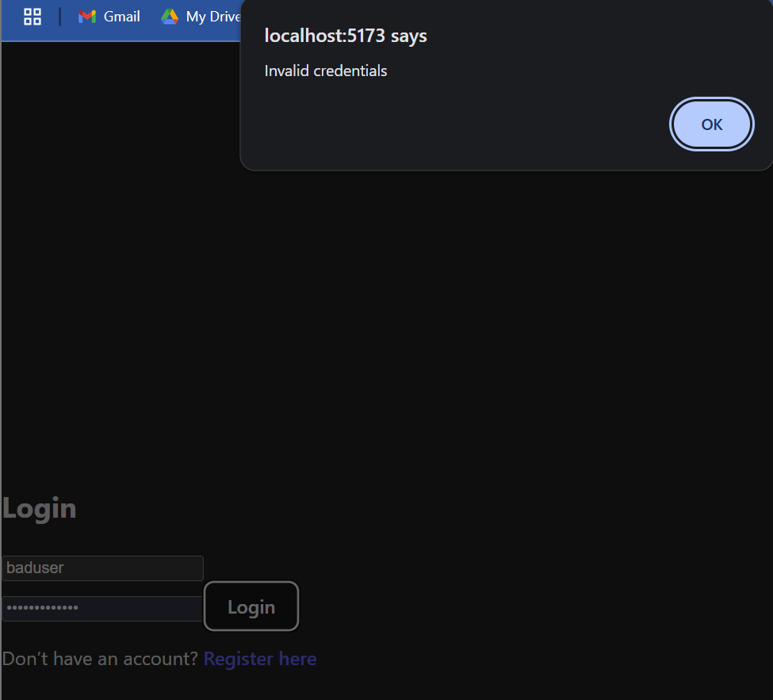
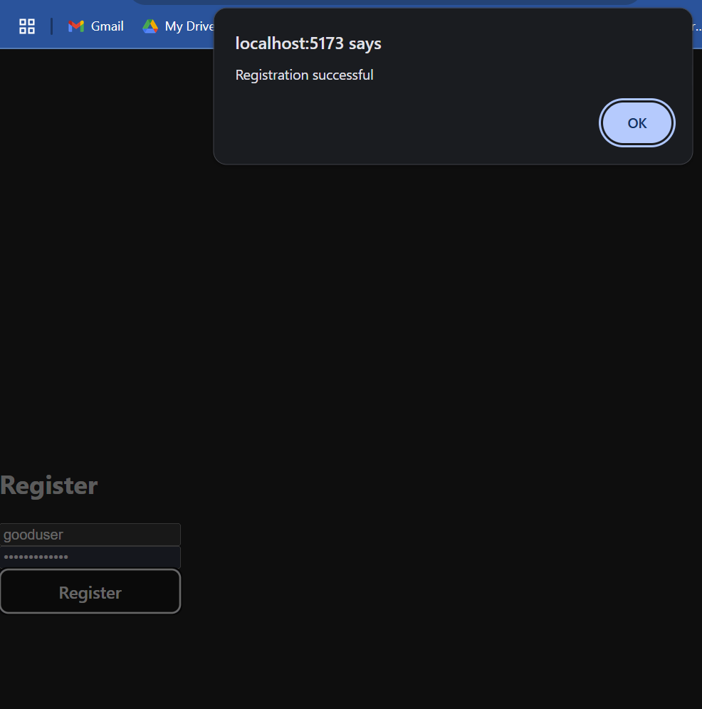
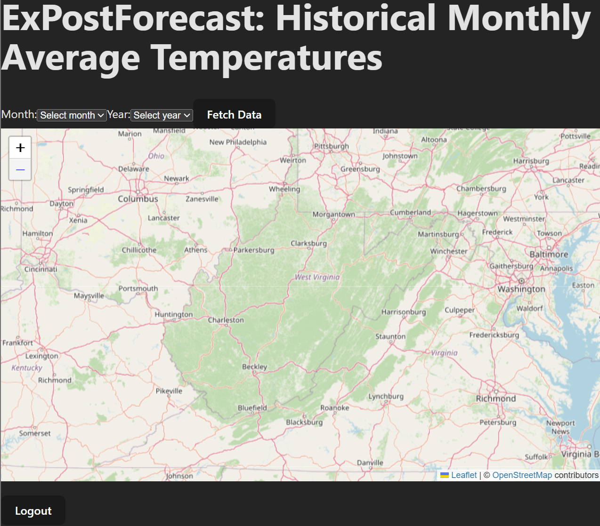

# xPostForecast

A reference full-stack web app used to teach CS 330 at West Virginia University. It maps **historical monthly average temperatures across West Virginia** from NOAA nClimGrid data, using a React + Leaflet frontend, a Node.js/Express backend, Azure Database for MySQL, and deployment to Azure.

> **This is a worked example, not a starter template.** Students build their own app, on their own topic, with the same stack and sprint structure, and use this repo to see what each finished sprint looks like.

## Sprints: one branch each

| Sprint | Branch | What it adds | What changed |
|--------|--------|--------------|--------------|
| 1 | [`sprint-1`](https://github.com/tdevine1/xPostForecast/tree/sprint-1) | React (Vite) frontend: Leaflet map and month/year selector | — |
| 2 | [`sprint-2`](https://github.com/tdevine1/xPostForecast/tree/sprint-2) | Express backend, Azure MySQL, login/registration with JWT cookies | [Sprint 1 → 2](https://github.com/tdevine1/xPostForecast/compare/sprint-1...sprint-2) |
| 3 | [`sprint-3`](https://github.com/tdevine1/xPostForecast/tree/sprint-3) | Real NOAA temperature data from the Planetary Computer STAC API | [Sprint 2 → 3](https://github.com/tdevine1/xPostForecast/compare/sprint-2...sprint-3) |
| 4 | [`main`](https://github.com/tdevine1/xPostForecast/tree/main) | Deployment to Azure Static Web Apps and App Service with GitHub Actions | [Sprint 3 → 4](https://github.com/tdevine1/xPostForecast/compare/sprint-3...main) |

Switch sprints with the branch dropdown on GitHub, or locally with `git switch sprint-2`. The **What changed** links show every file a sprint added or modified.

**Instructors:** the setup and deployment runbook is at **<https://tdevine1.github.io/xPostForecast/>** (source in [`docs/`](https://github.com/tdevine1/xPostForecast/tree/main/docs) on `main`).

---

# Sprint 2 – Authentication & Backend

In **Sprint 2**, we build on Sprint 1's frontend by adding a backend and a login system. Students learn how to connect a React (Vite) frontend to an Express backend backed by Azure Database for MySQL, implement registration and login, and protect pages with a JWT stored in an HTTP-only cookie.

Keep working in the repo you created in Sprint 1: add a `backend/` folder next to your `frontend/` and build the equivalent auth flow for your own topic, using this branch as your worked example.

---

## 🎯 Goals of Sprint 2

- **Backend setup**: an Express app with `/auth/register`, `/auth/login`, `/auth/test`, and `/auth/logout`.
- **Database integration**: connect to Azure Database for MySQL with `mysql2` over TLS.
- **Secure authentication**:
  - Hash passwords with `bcryptjs` (never store plaintext).
  - Issue a JWT on login and store it in an HTTP-only cookie.
- **Frontend integration**:
  - Add `Login.jsx` and `Register.jsx` pages.
  - Update `App.jsx` to check the session on startup and guard the `/map` route.

---

## 🔄 What's Different from Sprint 1

See every changed file: **[Sprint 1 → 2 diff](https://github.com/tdevine1/xPostForecast/compare/sprint-1...sprint-2)**.

| Feature           | Sprint 1                       | Sprint 2                                                     |
| ----------------- | ------------------------------ | ------------------------------------------------------------ |
| Project scope     | Frontend only (map & selector) | Full stack: frontend and backend                             |
| Routing           | Single `/map` route            | `/login`, `/register`, `/map` (protected), with redirects    |
| Backend           | None                           | Express app in `backend/`                                    |
| Database          | None                           | Azure MySQL over TLS (`backend/config/database.js`)          |
| Auth              | Logout button is a stub        | Real registration, login, and logout                         |
| Login persistence | None                           | HTTP-only cookie, checked with `GET /auth/test` on page load |

---

## 📁 What's in This Branch

```text
.
├── .github/workflows/ci.yml          # lint + test (+ build) for frontend and backend
├── backend/                          # Express + MySQL backend
│   ├── app.js                        # middleware + routes (no listen; tests import this)
│   ├── server.js                     # entry point: checks env vars, starts listening
│   ├── config/
│   │   ├── env.js                    # loads backend/.env for local development
│   │   ├── database.js               # MySQL connection pool over TLS
│   │   ├── cookies.js                # auth cookie options (dev vs production)
│   │   └── DigiCertGlobalRootG2.crt.pem  # CA certificate for Azure MySQL
│   ├── db/schema.sql                 # creates the authdb database and users table
│   ├── middleware/authMiddleware.js  # JWT cookie check for protected routes
│   ├── routes/auth.js                # /auth/register, /login, /test, /logout
│   ├── tests/auth.test.js            # API tests (database mocked)
│   └── .env.example                  # template for backend/.env
├── frontend/                         # Vite + React frontend
│   ├── src/
│   │   ├── pages/                    # Login.jsx, Register.jsx, MapPage.jsx
│   │   ├── components/               # DateSelector.jsx, MapComponent.jsx
│   │   ├── App.jsx                   # routes + session check
│   │   └── App.test.jsx              # routing/session tests
│   └── .env.example                  # template for frontend/.env
└── images/                           # screenshots used in the docs
```

---

## 🛠 Setup Guides

Step-by-step instructions live with each part:

- **Backend** (database, `.env`, running and testing the API): [`backend/README.md`](./backend/README.md)
- **Frontend** (`.env`, how the cookie-based login works): [`frontend/README.md`](./frontend/README.md)

Start the backend first (port 5175), then the frontend (port 5173).

## 🧪 Test the Authentication Flow

1. **Register**: open `http://localhost:5173/register` and enter an email, a username, and a password of at least 8 characters.
2. **Log in** at `/login` with that username and password.
3. **Access the map**: you're redirected to `/map`. Fetch Data is still a stub in this sprint.
4. **Refresh the page**: you stay logged in, because the cookie is checked with `/auth/test` on load.
5. **Log out**: the Logout button clears the cookie and returns you to `/login`.

## 🔍 Login & Registration Walkthrough

These screenshots were taken before the email field was added to the registration form. The flow is otherwise the same.

**Login failure**: an unknown username or wrong password shows an error.



**Registration success**: submitting a new username shows a confirmation alert.



**Logging in**: valid credentials redirect to the protected map view.



The login persists if you refresh or close and reopen the tab (until the cookie expires after 1 hour). Use the Logout button to end the session.

## 📚 Further Resources

- **Express**: <https://expressjs.com/>
- **mysql2**: <https://sidorares.github.io/node-mysql2/docs>
- **bcryptjs**: <https://github.com/dcodeIO/bcrypt.js>
- **jsonwebtoken**: <https://github.com/auth0/node-jsonwebtoken>
- **MDN: Using HTTP cookies**: <https://developer.mozilla.org/docs/Web/HTTP/Guides/Cookies>
- **React Router**: <https://reactrouter.com/>

---

In **Sprint 3**, the map gets real data: the backend fetches NOAA temperature grids from Microsoft Planetary Computer and the frontend draws them.
