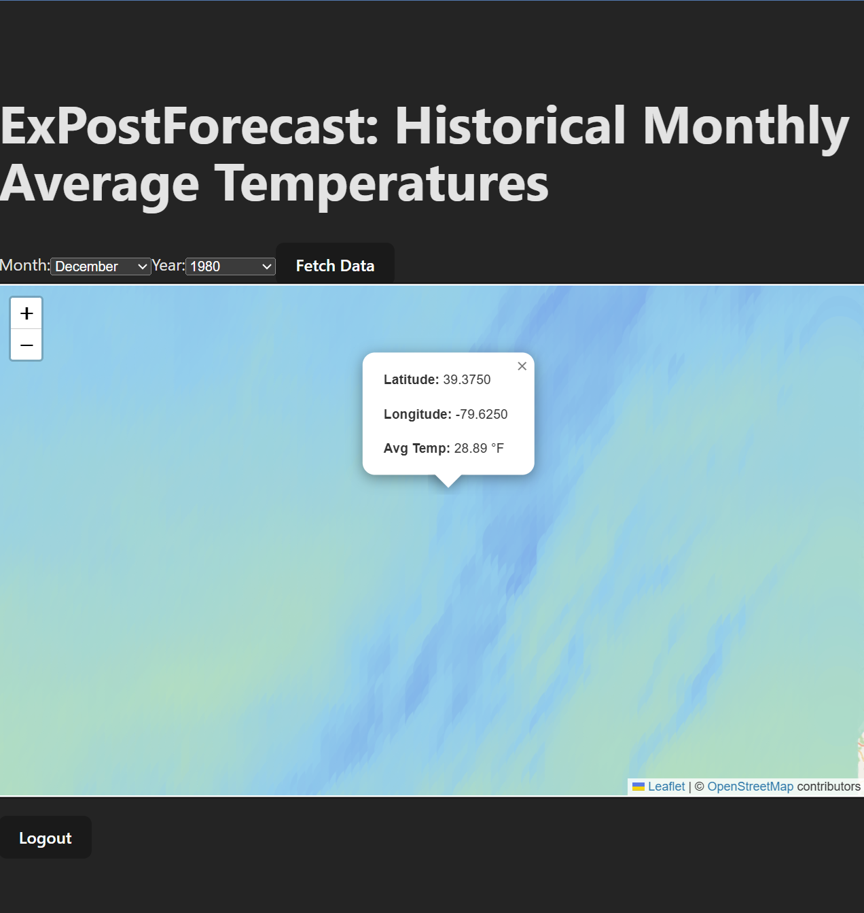

# xPostForecast

A reference full-stack web app used to teach CS 330 at West Virginia University. It maps **historical monthly average temperatures across West Virginia** from NOAA nClimGrid data, using a React + Leaflet frontend, a Node.js/Express backend, Azure Database for MySQL, and deployment to Azure.

> **This is a worked example, not a starter template.** Students build their own app, on their own topic, with the same stack and sprint structure, and use this repo to see what each finished sprint looks like.

## Sprints: one branch each

| Sprint | Branch | What it adds | What changed |
|--------|--------|--------------|--------------|
| 1 | [`sprint-1`](https://github.com/tdevine1/xPostForecast/tree/sprint-1) | React (Vite) frontend: Leaflet map and month/year selector | — |
| 2 | [`sprint-2`](https://github.com/tdevine1/xPostForecast/tree/sprint-2) | Express backend, Azure MySQL, login/registration with JWT cookies | [Sprint 1 → 2](https://github.com/tdevine1/xPostForecast/compare/sprint-1...sprint-2) |
| 3 | [`sprint-3`](https://github.com/tdevine1/xPostForecast/tree/sprint-3) | Real NOAA temperature data from the Planetary Computer STAC API | [Sprint 2 → 3](https://github.com/tdevine1/xPostForecast/compare/sprint-2...sprint-3) |
| 4 | [`main`](https://github.com/tdevine1/xPostForecast/tree/main) | Deployment to Azure Static Web Apps and App Service with GitHub Actions | [Sprint 3 → 4](https://github.com/tdevine1/xPostForecast/compare/sprint-3...main) |

Switch sprints with the branch dropdown on GitHub, or locally with `git switch sprint-2`. The **What changed** links show every file a sprint added or modified.

**Instructors:** the setup and deployment runbook is at **<https://tdevine1.github.io/xPostForecast/>** (source in [`docs/`](https://github.com/tdevine1/xPostForecast/tree/main/docs) on `main`).

---



# Sprint 4 – Cloud Deployment (Instructor-Provisioned Resources)

In Sprint 4, your team deploys the full-stack app to **Microsoft Azure**, using cloud resources the instructor has already created for your group:

- **Azure Static Web Apps (SWA)** hosts the built React frontend
- **Azure App Service** (Web App for Linux, Node 24 LTS) runs the Express backend
- **Azure Database for MySQL – Flexible Server**, the same database you've used since Sprint 2

The instructor acts as the cloud administrator (creating resources); your team acts as the DevOps team (configuring, deploying, and debugging). Deploy your own group's repo, using this branch as your worked example for the GitHub Actions workflows and Azure settings.

See every changed file: **[Sprint 3 → 4 diff](https://github.com/tdevine1/xPostForecast/compare/sprint-3...main)**.

---

## 🏗️ Architecture

```text
                       push to main
   GitHub repo  ────────────────────────►  GitHub Actions
                                            ├─ deploy-frontend.yml: test → build (with VITE_BACKEND_API_URL) → upload
                                            └─ deploy-backend.yml:  test → upload (publish profile)
                                                  │                         │
                                                  ▼                         ▼
 Browser ── loads site ──►  Static Web App          App Service (Node 24)  ── TLS ──►  Azure MySQL
    │                       https://<swa>.azurestaticapps.net     https://<app>.azurewebsites.net
    └──────── API calls with auth cookie (CORS, credentials) ────────────►│
                                                                           └── HTTPS ──►  Planetary Computer
```

The frontend and backend live on **different sites**, which shapes two settings:

- **CORS**: the backend's `FRONTEND_URL` must be the SWA URL exactly.
- **Cookies**: browsers only send cross-site cookies marked `SameSite=None; Secure`, so with `NODE_ENV=production` the backend sets the auth cookie as `HttpOnly; Secure; SameSite=None; Partitioned` (see [`backend/config/cookies.js`](./backend/config/cookies.js)).

---

## 🧑‍🏫 What the Instructor Has Already Created (Per Group)

1. **Static Web App**: region, plan, and resource group set.
2. **App Service** (Web App for Linux): Node 24 LTS runtime, in your group's resource group.
3. **Azure MySQL Flexible Server**: created in Sprint 2, with networking that allows Azure services (including your App Service) to connect.

You do **not** create or delete Azure resources in this sprint.

---

## 🎯 Your Team's Responsibilities

1. **Backend → App Service** ([`backend/README.md`](./backend/README.md))
   - Add the publish profile and app name to GitHub
   - Add the deploy workflow
   - Set the App Service environment variables (database, `JWT_SECRET`, `FRONTEND_URL`, `NODE_ENV=production`)
   - Verify `/health` and the startup logs
2. **Frontend → Static Web App** ([`frontend/README.md`](./frontend/README.md))
   - Add the backend URL (`VITE_BACKEND_API_URL`) and the deployment token to GitHub
   - Add or fix the deploy workflow
   - Add `staticwebapp.config.json` so page refreshes work
3. **End-to-end validation**: register, log in, refresh, fetch data, log out on the live site; use the browser's dev tools and the App Service log stream to investigate problems.

---

## 🆕 What Changed from Sprint 3

| Area | Change |
|---|---|
| `.github/workflows/deploy-backend.yml` | **New.** On pushes to `main` that touch `backend/`: install, test, remove dev packages, deploy to App Service |
| `.github/workflows/deploy-frontend.yml` | **New.** On pushes to `main` that touch `frontend/`: install, test, build with `VITE_BACKEND_API_URL`, upload to SWA |
| `frontend/public/staticwebapp.config.json` | **New.** Sends unknown paths such as `/map` to `index.html` so refreshing a page doesn't 404 |
| `frontend/src/api.js` | Logs the API base URL to the browser console (a quick way to confirm the build got the right URL) |

The backend code needs no changes: it was written from Sprint 2 on to read `PORT` and all settings from the environment, and to switch cookie settings with `NODE_ENV`.

---

## ✅ End-to-End Validation (Live Site)

- [ ] `https://<your-backend>.azurewebsites.net/health` returns `{"ok":true,"env":"production"}`
- [ ] The SWA URL loads; the browser console shows `Frontend API Base URL: https://<your-backend>.azurewebsites.net`
- [ ] Register and log in work
- [ ] Refreshing on `/map` keeps you logged in (no 404, no bounce to `/login`)
- [ ] Fetch Data draws temperatures for a month between 1895 and September 2022
- [ ] Logout returns you to `/login`, and `/map` then redirects to `/login`
- [ ] No CORS errors in the console; no crashes or database errors in the App Service log stream

---

## 🔧 Maintaining This Repo (Instructors)

**Per-semester Azure setup** for this reference deployment (resources, GitHub secrets and variables) is in the [instructor runbook](https://tdevine1.github.io/xPostForecast/).

**Fixing something that exists in several sprints**: make the fix on the **earliest** sprint branch that has the problem, then merge it forward so every later sprint gets it:

```bash
git switch sprint-2 && git commit -am "Fix ..." && git push
git switch sprint-3 && git merge sprint-2 && git push
git switch main     && git merge sprint-3 && git push
```

CI runs on every branch, so each merge is tested. Changes that only make sense in a later sprint go directly on that sprint's branch.

**Instructor docs** (`docs/`) live only on `main` and are published by GitHub Pages (Settings → Pages → Deploy from a branch → `main` / `/docs`).

---

## 🙏 Credits

The instructor runbook in [`docs/`](./docs) was written by **Grace Hanson** (WVU) under Tom Devine; its original commit history is preserved in this repository. See [`docs/LICENSE`](./docs/LICENSE).

## License

MIT. See [LICENSE](./LICENSE).

