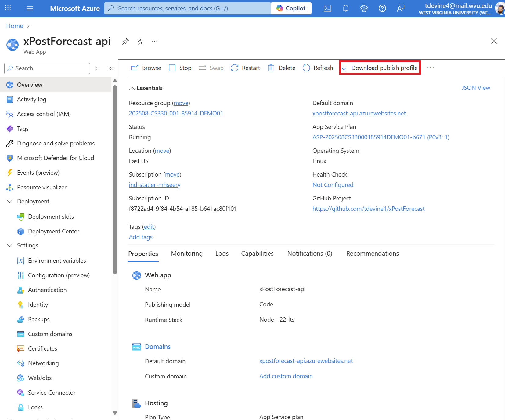
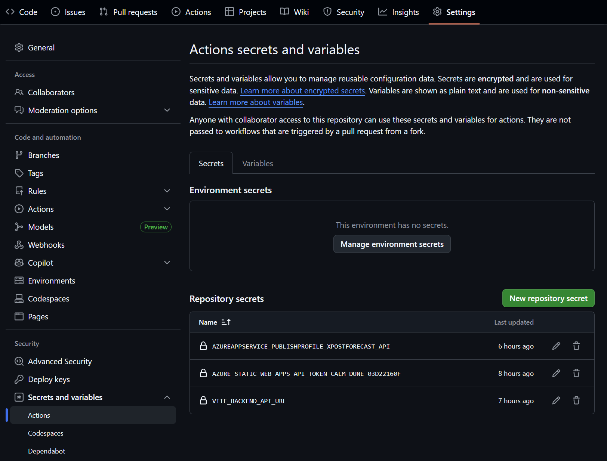
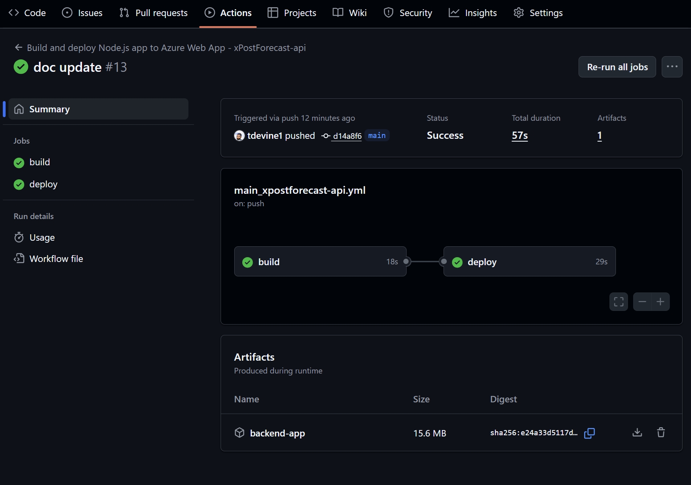
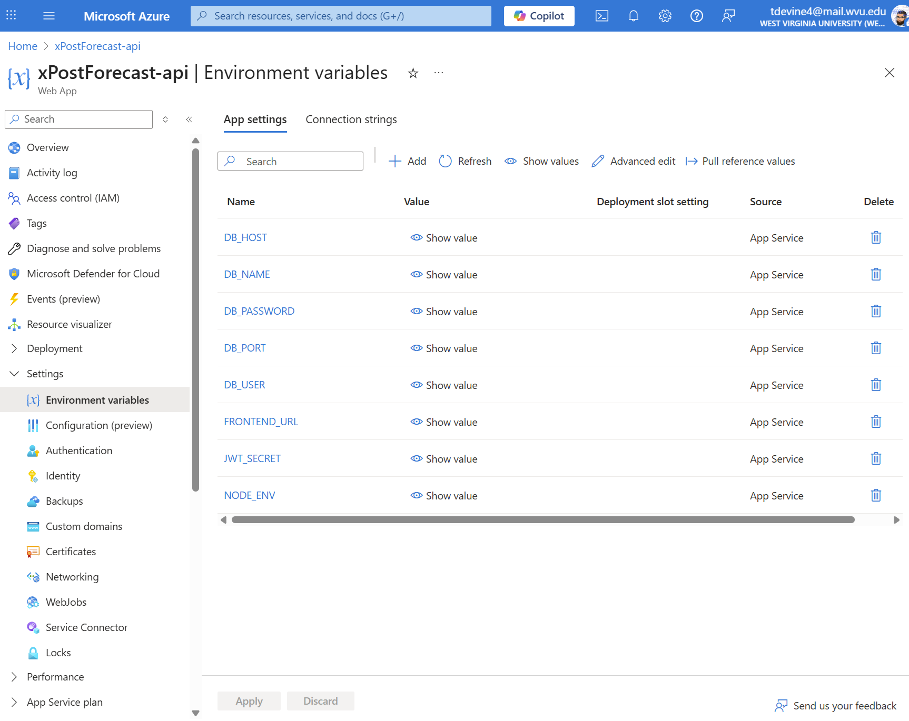
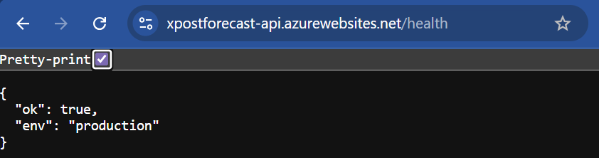
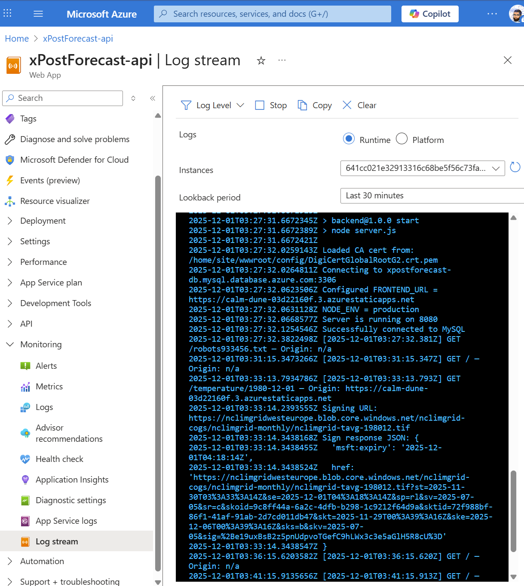

# Sprint 4 – Backend Deployment (Azure App Service)
### Instructor-provisioned App Service: students configure, deploy, and verify

> This is the **reference implementation** for Sprint 4's backend deployment. Deploy your own group's `backend/` (from Sprints 1–3) using this as your worked example; don't clone or fork this one.

Your group's **Azure App Service (Web App for Linux)** has already been created by the instructor. Your team will:

- Let GitHub Actions deploy to it (publish profile + app name)
- Add the deploy workflow
- Configure its **environment variables** (database, JWT secret, frontend URL)
- Verify the deployment with `/health` and the log stream

How the backend itself works (routes, auth, temperature data) is covered in the [Sprint 3 backend guide](https://github.com/tdevine1/xPostForecast/blob/sprint-3/backend/README.md); local setup is in the [Sprint 2 backend guide](https://github.com/tdevine1/xPostForecast/blob/sprint-2/backend/README.md). The code is unchanged in Sprint 4.

---

## 1. Prerequisites and Context

You have:

- A working backend in your repo's `backend/` folder (adjust the paths below if yours lives elsewhere)
- The Azure MySQL database from Sprint 2 (same host, database, user)
- An App Service created for your group, with the **Node 24 LTS** runtime

The instructor provides:

- The **App Service name** and **URL** (e.g. `https://<your-backend>.azurewebsites.net`)
- The **Static Web App URL** (for `FRONTEND_URL`)

---

## 2. Give GitHub Permission to Deploy

GitHub Actions authenticates to App Service with the App Service's **publish profile**.

### 2.1 Download the publish profile

1. Azure Portal → **App Services** → your group's App Service.
2. On the **Overview** page, click **Download publish profile** in the toolbar.

This downloads an XML file (`<app-name>.PublishSettings`).



> If **Download publish profile** is greyed out, basic-auth publishing is turned off for the app. Ask your instructor to enable **Settings → Configuration → General settings → SCM Basic Auth Publishing Credentials**.

### 2.2 Add it to GitHub

In your GitHub repo: **Settings → Secrets and variables → Actions**.

1. **Secrets** tab → **New repository secret**:
   - Name: `APP_SERVICE_PUBLISH_PROFILE`
   - Value: the **entire** contents of the `.PublishSettings` file
2. **Variables** tab → **New repository variable**:
   - Name: `AZURE_WEBAPP_NAME`
   - Value: your App Service's name (exactly as shown in the portal)

The publish profile is a password for deploying to your app: it belongs in a **secret** and must never be committed. The app name isn't sensitive, so it's a plain **variable**.



*(This screenshot is from a repo whose secrets were generated by Azure, so the names differ; use the names above.)*

> Delete the downloaded `.PublishSettings` file afterwards, or at least make sure it is never inside your repo folder.

---

## 3. Add the Deploy Workflow

Create `.github/workflows/deploy-backend.yml` (this repo's [`deploy-backend.yml`](../.github/workflows/deploy-backend.yml)):

```yaml
name: Deploy backend (App Service)

on:
  push:
    branches: [main]
    paths:
      - 'backend/**'
      - '.github/workflows/deploy-backend.yml'
  workflow_dispatch:

concurrency: deploy-backend

jobs:
  build-test-deploy:
    runs-on: ubuntu-latest
    permissions:
      contents: read
    defaults:
      run:
        working-directory: backend
    steps:
      - uses: actions/checkout@v7

      - uses: actions/setup-node@v7
        with:
          node-version: '24'
          cache: npm
          cache-dependency-path: backend/package-lock.json

      # (this repo's file also has a step that fails early if the secret or variable is missing)

      - run: npm ci
      - run: npm test

      - name: Remove dev-only packages before upload
        run: npm prune --omit=dev

      - name: Deploy to Azure App Service
        uses: azure/webapps-deploy@v3
        with:
          app-name: ${{ vars.AZURE_WEBAPP_NAME }}
          publish-profile: ${{ secrets.APP_SERVICE_PUBLISH_PROFILE }}
          package: backend
```

What each part does:

- **`paths`**: only changes under `backend/` (or to this file) trigger a deployment; editing the frontend doesn't redeploy the backend. **`workflow_dispatch`** adds a manual **Run workflow** button in the Actions tab.
- **`concurrency`**: two pushes in a row can't deploy over each other.
- **`npm ci`** installs exactly what `package-lock.json` lists. **`npm test`** runs the backend tests; a failing test stops the deployment, so broken code never reaches Azure.
- **`npm prune --omit=dev`** removes test tools (Vitest, Supertest, oxlint) before upload, so the deployment is smaller.
- **`package: backend`**: the folder to upload, relative to the repo root (`working-directory` doesn't apply to `uses:` steps).
- **`node-version`** should match the App Service runtime (Node 24 LTS).

> **Azure may already have added a workflow** to your repo (named like `main_<app-name>.yml`) if the App Service's Deployment Center was connected to GitHub. Keep only **one** backend deploy workflow: delete the generated file, or edit it to use the paths above. Also make sure your `test` script really runs tests; npm's default `"test": "echo \"Error: no test specified\" && exit 1"` always fails the deployment.

Commit and push. In the **Actions** tab, **Deploy backend (App Service)** should go green:



---

## 4. Configure Environment Variables

The App Service has no `.env` file (and must not: `.env` is never committed). The same values are set in the portal instead.

1. Azure Portal → your App Service → **Settings → Environment variables** → **App settings** tab.
2. Add each setting below with **+ Add**, then click **Apply** (the app restarts).



| Name | Value |
|---|---|
| `DB_HOST` | `<server>.mysql.database.azure.com` (same as your local `.env`) |
| `DB_USER` | database username (same as local) |
| `DB_PASSWORD` | database password. Must be named exactly this; the code reads `process.env.DB_PASSWORD` |
| `DB_NAME` | `authdb` (or your team's database name) |
| `DB_PORT` | `3306` (optional; that's the default) |
| `FRONTEND_URL` | your SWA URL, exactly: `https://<your-swa>.azurestaticapps.net` (no trailing slash) |
| `JWT_SECRET` | a **new** long random string (don't reuse your local one) |
| `NODE_ENV` | `production` |

Do **not** add `PORT` (see 4.2).

### 4.1 Why `NODE_ENV=production` matters

It switches on two production behaviors in the backend:

- **Cookie settings** (`config/cookies.js`): your frontend (`*.azurestaticapps.net`) and backend (`*.azurewebsites.net`) are **different sites**. Browsers only send a cookie with cross-site requests if it is marked `SameSite=None` and `Secure`, so in production the auth cookie is `HttpOnly; Secure; SameSite=None; Partitioned`. With the development setting (`SameSite=Lax`), login would return 200 but the browser would never send the cookie back, so every page would act logged out.
- **`trust proxy`** (`app.js`): App Service receives HTTPS and forwards plain HTTP to your app. Trusting the proxy's headers lets Express see the original request as HTTPS (needed for `Secure` cookies) and see the real client IP (needed for login rate limiting).

`server.js` also checks the required settings at startup. If one is missing, the log stream shows `Missing required environment variables: …` and the app stops, which is much easier to diagnose than a crash later.

### 4.2 How the port works on App Service

App Service chooses the port your app must listen on and passes it in the `PORT` environment variable (commonly 8080). The backend already reads it:

```js
const PORT = Number(process.env.PORT) || 5175;
```

Locally `PORT` is 5175 (or unset); on Azure it is whatever App Service assigns. If an app listened on a hard-coded port, App Service's health probe would never reach it and the app would never be marked as started.

---

## 5. Database Connectivity

- The MySQL server and database were created in Sprint 2. The instructor configured its networking to allow connections from Azure services such as your App Service.
- The CA certificate (`config/DigiCertGlobalRootG2.crt.pem`) is part of your code, so it is deployed with it.
- If the log stream shows `MySQL connection failed on startup` with `ETIMEDOUT`, tell your instructor: it's a network/firewall setting on the server.

From your side, check `DB_HOST`, `DB_USER`, `DB_PASSWORD`, and `DB_NAME`.

---

## 6. Verify the Deployment

### 6.1 `/health`

Visit `https://<your-backend>.azurewebsites.net/health`:

```json
{ "ok": true, "env": "production" }
```

If `env` says `development`, `NODE_ENV` isn't set.



### 6.2 Log stream

Azure Portal → your App Service → **Monitoring → Log stream**. Restart the app (Overview → **Restart**) and watch:

```text
Connecting to MySQL at <server>.mysql.database.azure.com:3306
Configured FRONTEND_URL = https://<your-swa>.azurestaticapps.net
NODE_ENV = production
Server is running on 8080
Successfully connected to MySQL
```

After that, each request is logged, e.g. `[2026-…] GET /auth/test — Origin: https://<your-swa>.azurestaticapps.net`.



*(Screenshot from an earlier version of the backend, which logged a few extra lines such as `Loaded CA cert from:` and the signing request. The text block above shows the current output.)*

---

## 7. Troubleshooting

| Symptom | Likely cause | Fix |
|---|---|---|
| Workflow fails: `AZURE_WEBAPP_NAME is not set` / `APP_SERVICE_PUBLISH_PROFILE is not set` | Missing GitHub variable or secret | Add it (step 2.2); names are case-sensitive |
| Workflow fails at the deploy step with an authentication error | Old or wrong publish profile | Download a fresh one and replace the secret |
| Workflow fails at `npm test` | A test is failing (or the default npm `test` script) | Run `npm test` locally and fix it |
| Log stream: `Missing required environment variables: …` | App setting missing or misspelled | Add it under Environment variables, then Apply |
| Log stream: `MySQL connection failed on startup` + `ETIMEDOUT` | Server networking | Tell your instructor |
| Log stream: `Access denied for user` | Wrong `DB_USER` / `DB_PASSWORD` | Compare with your working local `.env` |
| `/health` shows `"env": "development"` | `NODE_ENV` not set | Add `NODE_ENV=production` |
| Browser console: CORS error mentioning `Access-Control-Allow-Origin` | `FRONTEND_URL` doesn't match the SWA URL exactly | Copy the SWA URL from the portal; no trailing slash |
| Login returns 200 but you're immediately logged out | Cookie not sent cross-site | `NODE_ENV=production`; see 4.1 and the [frontend guide](../frontend/README.md#6-cookies-between-two-sites) |
| `Application Error` page / app keeps restarting | Startup crash | Read the first error in the log stream |

---

## 8. Summary

Your team has:

- Connected GitHub Actions to App Service with a publish profile (secret) and app name (variable)
- Added a workflow that tests the backend and deploys it on every push to `main` that changes `backend/`
- Configured App Service environment variables, including production cookie behavior
- Verified the deployment with `/health` and the log stream


Next: deploy the frontend with [`../frontend/README.md`](../frontend/README.md).
