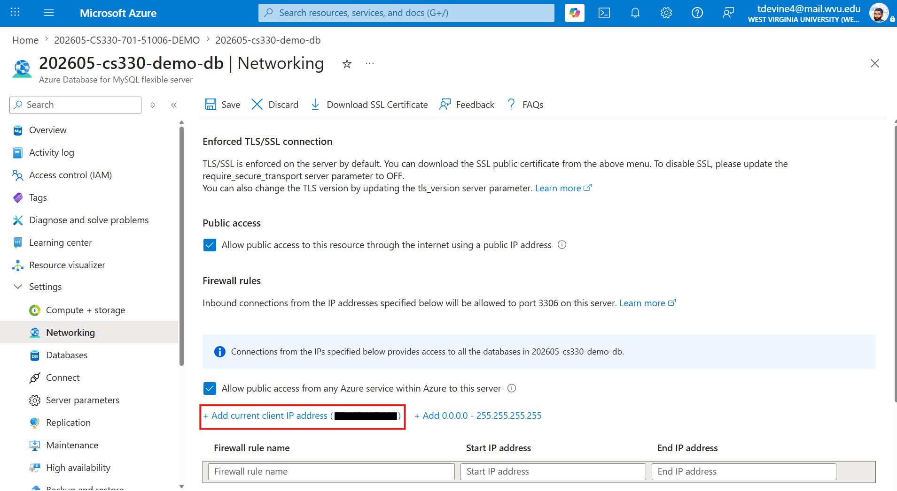
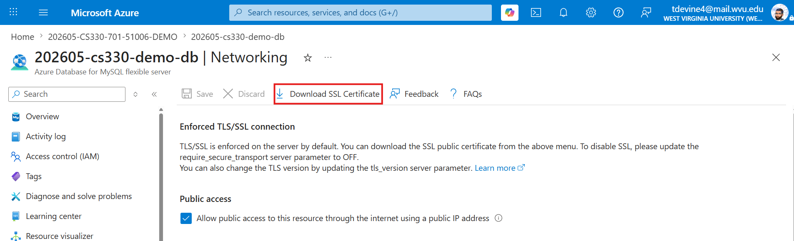

# Sprint 2 Backend: Setup & Database Integration Guide

In **Sprint 2**, you build your first backend: an Express server that handles user authentication and connects to an **Azure Database for MySQL** server over **TLS**. This guide matches the code in this folder: ES modules, `mysql2/promise`, JWT login stored in an **HTTP-only cookie**, and **email + username + password** registration.

> This is the **reference implementation**. Build the equivalent `backend/` in your own project repo; don't clone or fork this one.

*Flow: React (Vite) ⇄ cookie-based auth ⇄ Express ⇄ Azure MySQL (TLS)*

---

## 📂 Backend Folder Structure

```text
backend/
├── app.js                         # middleware + routes (exported; tests import it)
├── server.js                      # entry point: checks env vars, starts listening
├── config/
│   ├── env.js                     # loads backend/.env (local development only)
│   ├── database.js                # MySQL connection pool over TLS
│   ├── cookies.js                 # auth cookie options (development vs production)
│   └── DigiCertGlobalRootG2.crt.pem   # CA certificate for Azure MySQL
├── db/
│   └── schema.sql                 # creates the authdb database and users table
├── middleware/
│   └── authMiddleware.js          # JWT cookie check for protected routes
├── routes/
│   └── auth.js                    # /auth/register, /login, /test, /logout
├── tests/
│   └── auth.test.js               # API tests (database mocked)
└── .env.example                   # template for your .env
```

---

## 🛠 Prerequisites

- **Node.js 24 LTS**
- The **`mysql` command-line client** (install instructions in step 4)
- An **Azure Database for MySQL – Flexible Server** (your instructor provides the host, admin user, and password)
- Your current public IP address allowed in **Azure Portal → your MySQL server → Networking → Firewall rules**



---

## 1) Install Dependencies

```bash
cd backend
npm install
```

---

## 2) Configure Environment Variables

Copy the template and edit it:

```bash
cp .env.example .env
```

```ini
PORT=5175
FRONTEND_URL=http://localhost:5173
NODE_ENV=development

JWT_SECRET=<paste a generated secret here>

DB_HOST=<your-server>.mysql.database.azure.com
DB_USER=<your-admin-user>
DB_PASSWORD=<your-password>
DB_NAME=authdb
DB_PORT=3306
```

Generate a JWT secret with:

```bash
node -e "console.log(require('crypto').randomBytes(32).toString('hex'))"
```

> **Never commit `.env`.** The repo's `.gitignore` excludes it; run `git status` before every commit to be sure.

`server.js` refuses to start, and lists what's missing, if any of `FRONTEND_URL`, `JWT_SECRET`, `DB_HOST`, `DB_USER`, `DB_PASSWORD`, or `DB_NAME` is empty. `config/env.js` reads `.env` with Node's built-in `process.loadEnvFile()`, so no `dotenv` package is needed.

---

## 3) Get the SSL (CA) Certificate

Azure MySQL requires encrypted connections, and the backend verifies the server's certificate against a CA certificate. This repo already includes `config/DigiCertGlobalRootG2.crt.pem`. In your own project, download it from Azure:

1. **Azure Portal** → your **MySQL Flexible Server**
2. Open **Networking**
3. Click **Download SSL Certificate**



Save it in your backend's `config/` folder:

```bash
# Example (adjust the download path)
mv ~/Downloads/DigiCertGlobalRootG2.crt.pem backend/config/DigiCertGlobalRootG2.crt.pem
```

---

## 4) Connect and Verify with the `mysql` CLI

Before wiring up the code, confirm you can reach the database from the command line. VS Code's integrated terminal works fine; no database extension is needed.

**Install the `mysql` client if you don't have it:**

| OS | Command |
|---|---|
| Windows | `winget install Oracle.MySQL` (or download the "MySQL Command Line Client" from [dev.mysql.com](https://dev.mysql.com/downloads/mysql/)) |
| macOS | `brew install mysql-client`, then add it to your PATH (`brew info mysql-client` shows the exact path) |
| Linux (Debian/Ubuntu) | `sudo apt install mysql-client` |

> **Windows note:** `winget install Oracle.MySQL` adds `mysql` to your PATH, but already-open terminals won't see the change. **Fully close and reopen VS Code** (not just the terminal panel) before running `mysql --version`. If it still isn't found, open a new Command Prompt and try there; if that fails too, log out and back in, or add the MySQL `bin` folder (typically `C:\Program Files\MySQL\MySQL Server 9.x\bin`) to your PATH.

```bash
mysql --version
```

**Connect** (from the `backend/` folder):

```bash
mysql -h <your-server>.mysql.database.azure.com -u <your-admin-user> -p --ssl-ca=config/DigiCertGlobalRootG2.crt.pem
```

Enter your password when prompted. These are the same `DB_HOST` / `DB_USER` / `DB_PASSWORD` values as in `.env`: if this connects, the app's connection will work too. Then try:

```sql
SHOW DATABASES;
SELECT CURRENT_USER();
```

Type `exit` to leave.

---

## 5) Create the Database and `users` Table

The schema is in [`db/schema.sql`](./db/schema.sql). Run it from the `backend/` folder:

```bash
mysql -h <your-server>.mysql.database.azure.com -u <your-admin-user> -p --ssl-ca=config/DigiCertGlobalRootG2.crt.pem < db/schema.sql
```

It creates the `authdb` database and this table:

```sql
CREATE TABLE IF NOT EXISTS users (
  id INT AUTO_INCREMENT PRIMARY KEY,
  email VARCHAR(255) NOT NULL UNIQUE,
  username VARCHAR(255) NOT NULL UNIQUE,
  password_hash VARCHAR(255) NOT NULL,
  created_at TIMESTAMP DEFAULT CURRENT_TIMESTAMP
);
```

The `UNIQUE` constraints are what stop two accounts from sharing a username or email; the backend turns that database error into a `409` response.

---

## 6) Run the Backend

```bash
npm run dev     # restarts automatically when you save a file (node --watch)
# or
npm start       # plain start, as on Azure
```

**Expected output:**

```text
Connecting to MySQL at <your-server>.mysql.database.azure.com:3306
Configured FRONTEND_URL = http://localhost:5173
NODE_ENV = development
Server is running on 5175
Successfully connected to MySQL
```

(The last two lines can appear in either order: the server and the database connection start at the same time.)

Check it's alive at <http://localhost:5175/health>, which should return `{"ok":true,"env":"development"}`.

---

## 7) Test the Auth Routes

All routes are mounted under `/auth`:

| Route | Method | Body | Success | Errors |
|---|---|---|---|---|
| `/auth/register` | POST | `{ email, username, password }` | `201` | `400` missing field or password under 8 characters, `409` username/email taken |
| `/auth/login` | POST | `{ username, password }` | `200`, sets the `token` cookie | `400` missing field, `401` wrong credentials |
| `/auth/test` | GET | — | `200 { ok: true, user: { id, username } }` | `401` no cookie or invalid/expired token |
| `/auth/logout` | POST | — | `200`, clears the cookie | — |

Login and register allow at most **20 attempts per IP address per 15 minutes** (`express-rate-limit`), which slows down password guessing.

**curl examples (local development):**

```bash
# Register
curl -i -X POST http://localhost:5175/auth/register \
  -H "Content-Type: application/json" \
  --data '{"email":"alice@example.com","username":"alice","password":"correct-horse"}'

# Login (saves the cookie to cookies.txt)
curl -i -X POST http://localhost:5175/auth/login \
  -H "Content-Type: application/json" \
  --data '{"username":"alice","password":"correct-horse"}' \
  -c cookies.txt

# Check the session (sends the saved cookie)
curl -i http://localhost:5175/auth/test -b cookies.txt

# Logout
curl -i -X POST http://localhost:5175/auth/logout -b cookies.txt
```

---

## 8) Automated Tests

```bash
npm test        # Vitest + Supertest
npm run lint    # oxlint
```

`tests/auth.test.js` sends real HTTP requests to the Express app (imported from `app.js`, so no server or port is needed) and replaces the database with a mock, so the tests run anywhere, including GitHub Actions. They check things that are easy to break without noticing, for example that passwords are stored only as hashes, the cookie is `HttpOnly`, and a token signed with the wrong secret is rejected.

---

## 🔐 CORS & Cookies (Important)

The frontend (port 5173) and backend (port 5175) are different **origins**, so the browser enforces CORS. `app.js` allows exactly one origin, `FRONTEND_URL`, and allows it to send cookies:

```js
app.use(cors({ origin: process.env.FRONTEND_URL, credentials: true }));
app.use(express.json());
app.use(cookieParser());
app.use('/auth', authRoutes);
```

The frontend must also opt in to sending cookies on each request:

```js
axios.post(`${API_URL}/auth/login`, body, { withCredentials: true }); // axios
fetch(`${API_URL}/auth/test`, { credentials: 'include' });           // fetch
```

**Cookie settings** are in `config/cookies.js`. Locally the frontend and backend are the **same site** (ports don't count), so the cookie uses `SameSite=Lax`. When deployed in Sprint 4 they are on **different sites**, so production uses `SameSite=None; Secure; Partitioned` (explained in Sprint 4).

---

## 🧭 Troubleshooting

| Symptom | Likely cause | Fix |
|---|---|---|
| `Missing required environment variables: ...` on start | `.env` missing or incomplete | Copy `.env.example` to `.env` and fill in every value |
| `401` from `/auth/test` (red in the browser console) | Not logged in yet | Normal before login or after logout |
| `404` for `/login` | Missing `/auth` prefix | Use `/auth/login` and `/auth/register` |
| CORS error, or cookie not set | Wrong `FRONTEND_URL`, or missing `credentials` on either side | `FRONTEND_URL` must match the frontend's address exactly (`http://localhost:5173`, no trailing slash) |
| `409` on register | Username or email already exists | Choose another, or delete the row in MySQL |
| `429 Too Many Requests` | Rate limit reached | Wait 15 minutes, or restart the backend (the counter is in memory) |
| `MySQL connection failed on startup` + `ETIMEDOUT` / `ERROR 2002` | Firewall rule missing or wrong host | Add your current IP in Azure → Networking; check `DB_HOST` |
| `Access denied for user` | Wrong username or password | Check `DB_USER` / `DB_PASSWORD` against the **Connect** page in the Azure Portal |
| `ER_BAD_DB_ERROR: Unknown database 'authdb'` | Schema not created | Run `db/schema.sql` (step 5) |
| TLS/SSL errors (`ERROR 2026`, `self-signed certificate`) | Wrong or missing CA file | Make sure `config/DigiCertGlobalRootG2.crt.pem` is the certificate downloaded from Azure |
| `mysql: command not found` right after installing | PATH change not picked up | **Fully restart VS Code**, or open a fresh Command Prompt |

---

## 📚 References

- Express: <https://expressjs.com/>
- mysql2: <https://sidorares.github.io/node-mysql2/docs>
- jsonwebtoken: <https://github.com/auth0/node-jsonwebtoken>
- bcryptjs: <https://github.com/dcodeIO/bcrypt.js>
- express-rate-limit: <https://express-rate-limit.mintlify.app/>
- Supertest: <https://github.com/ladjs/supertest>
- MDN CORS: <https://developer.mozilla.org/docs/Web/HTTP/Guides/CORS>
