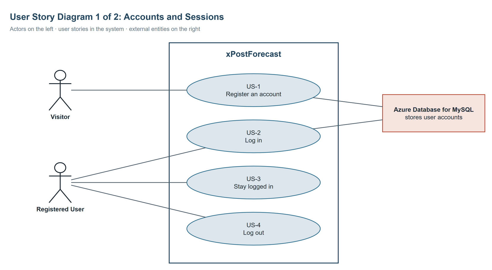
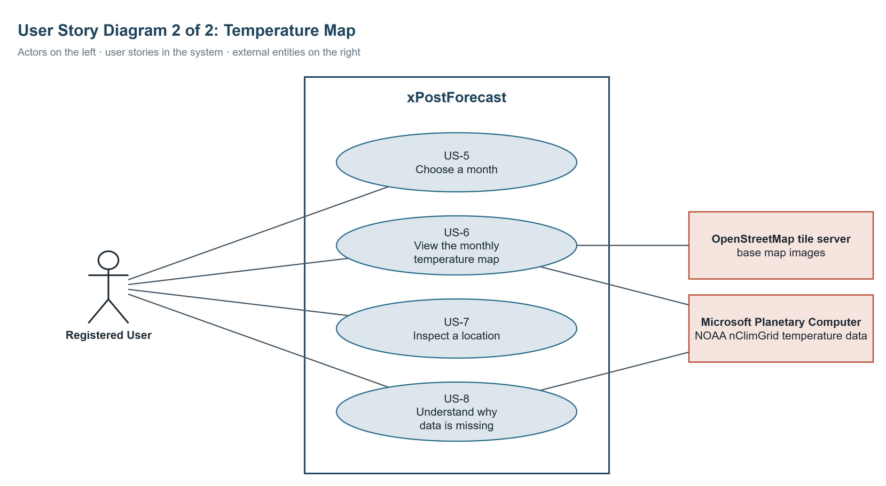
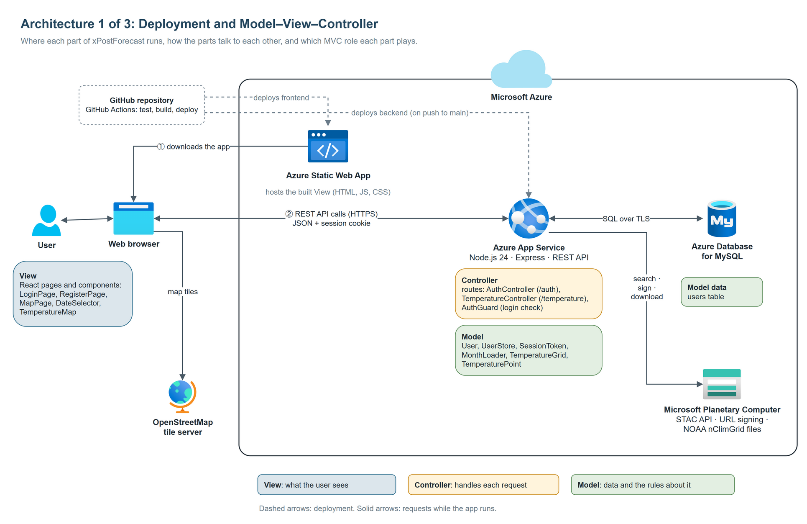
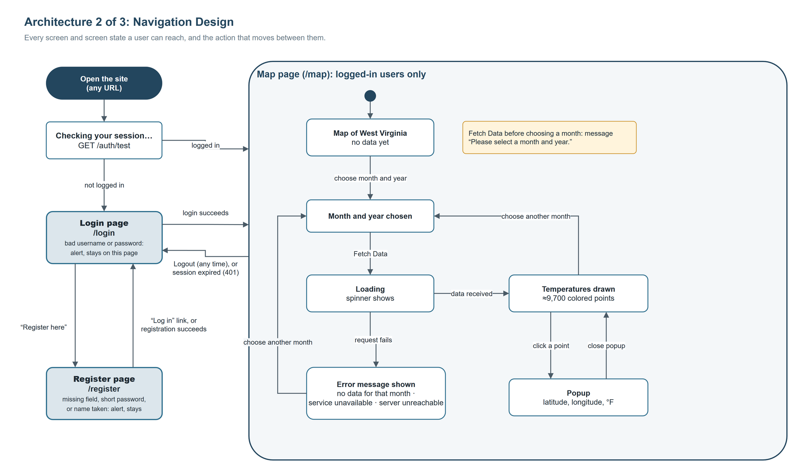
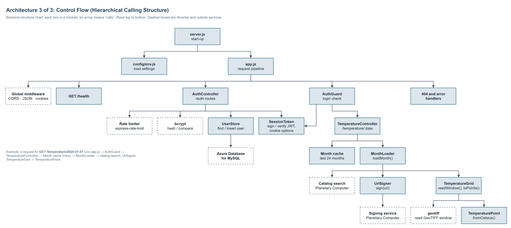

# xPostForecast Design Artifacts

Worked examples of the design deliverables for CS 330 Milestones 2–4, made for the finished xPostForecast app on this branch. Every artifact describes the real code, so you can check each claim against the source, and each one builds on the one before it:

```text
User stories ──► Grammatical parse ──► CRC cards
     │                  │
     └──► User story diagrams (actors, stories, external entities)
                        │
              Architecture views (Milestone 3) ──► Component designs (Milestone 4)
```

Diagrams are draw.io files (`.drawio`, open them at [app.diagrams.net](https://app.diagrams.net) or in the draw.io desktop app), each with a PDF exported from draw.io. The CRC cards are a PowerPoint file.

## User stories

[`user-stories.md`](./user-stories.md): eight stories (US-1 to US-8) with acceptance criteria, for two kinds of users, Visitor and Registered User. Every later artifact refers to them by ID.

## Milestone 2: Modeling

| Deliverable | File | What it shows |
|---|---|---|
| Grammatical Parse Table | [`grammatical-parse.md`](./milestone-2/grammatical-parse.md) | Nouns and verbs from every story, classified, and what each became: a class, attribute, method, actor, external entity, or rejected (with the reason) |
| User Story Diagrams | [`user-story-diagrams.pdf`](./milestone-2/user-story-diagrams.pdf) ([`.drawio`](./milestone-2/user-story-diagrams.drawio)) | Two diagrams, split to avoid clutter: accounts and sessions; the temperature map |
| CRC Cards | [`crc-cards.pptx`](./milestone-2/crc-cards.pptx) ([readable copy](./milestone-2/crc-cards.md)) | 17 classes, one per slide: description, what each knows and does, collaborators |
| Contribution Allocation Sheet | [`contribution-allocation-example.md`](./contribution-allocation-example.md) | The required format (submitted in eCampus) |





How the rubric is met:

- **Grammatical parse:** the parse covers every story, separates nouns, verbs, and key phrases, and its last column names the exact CRC card, attribute, or method each candidate became.
- **User story diagrams:** actors on the left, a boundary labeled xPostForecast with the stories in ovals, external entities on the right, and connectors between them. A second diagram keeps each one readable.
- **CRC cards:** every card has a class name and description, *Knows* (attributes) and *Does* (methods), and collaborators. There is one class per slide, saved as a PowerPoint file.

## Milestone 3: Architectural Design

Three distinct views, each readable on its own:

| View | File |
|---|---|
| 1. Overall architectural style: deployment on Azure, with the Model–View–Controller roles marked | [`architecture-1-deployment-mvc.pdf`](./milestone-3/architecture-1-deployment-mvc.pdf) |
| 2. Navigation design: every screen and screen state, and the action that moves between them | [`architecture-2-navigation.pdf`](./milestone-3/architecture-2-navigation.pdf) |
| 3. Control flow: the backend's hierarchical calling structure (structure chart) | [`architecture-3-control-flow.pdf`](./milestone-3/architecture-3-control-flow.pdf) |







Principles from the lectures that each view makes visible:

- **Model–View–Controller:** view 1 marks which part of the system plays each role. The View (React) runs in the browser, and its files are hosted by the Static Web App. The Controller (the Express routes) and the Model (the data classes, the MySQL database, and Planetary Computer) are on the server side.
- **Client–server:** view 1 shows that the browser talks to two servers. It downloads the app from the Static Web App, then calls the App Service's REST API directly.
- **Separation of concerns:** in views 1 and 3, the login check (AuthGuard) is separate from the routes it protects.
- **Information hiding:** in view 3, only UserStore talks to the database, and every contact with Planetary Computer happens inside the MonthLoader branch (catalog search, UrlSigner, TemperatureGrid).
- **Simplicity:** each diagram shows one view, with a title and a one-line explanation, and nothing it doesn't need.

## Milestone 4: Component-Level Design

Four backend components, each with a pseudocode PDF (name, description naming and explaining design principles, language-agnostic pseudocode) and a flowchart PDF that follows the pseudocode step by step. Text versions are in [`milestone-4/README.md`](./milestone-4/README.md).

| Component | Principles explained | Pseudocode | Flowchart |
|---|---|---|---|
| 1. User Registration | Information hiding; separation of concerns | [PDF](./milestone-4/Component1_Registration_Pseudocode.pdf) | [PDF](./milestone-4/Component1_Registration_Flowchart.pdf) |
| 2. User Login | Information hiding; functional independence | [PDF](./milestone-4/Component2_Login_Pseudocode.pdf) | [PDF](./milestone-4/Component2_Login_Flowchart.pdf) |
| 3. Monthly Temperature Request | Separation of concerns; modularity | [PDF](./milestone-4/Component3_MonthlyTemperatureRequest_Pseudocode.pdf) | [PDF](./milestone-4/Component3_MonthlyTemperatureRequest_Flowchart.pdf) |
| 4. Load Month | Abstraction and stepwise refinement; information hiding | [PDF](./milestone-4/Component4_LoadMonth_Pseudocode.pdf) | [PDF](./milestone-4/Component4_LoadMonth_Flowchart.pdf) |

Notes for students:

- **Flowchart and pseudocode agree:** every IF in the pseudocode is a decision diamond in the flowchart, in the same order, with the same outcomes.
- **Standard symbols:** rounded terminators for start and end, rectangles for processes, parallelograms for input, diamonds for decisions, and a double-sided rectangle for a call to another component (Component 3 calling Component 4).
- **Same layer throughout:** all four components are backend logic, so no flowchart mixes what the user sees with what the server does.
- **Complex enough:** each component has several decisions; Component 4 also has a loop with early exits.
