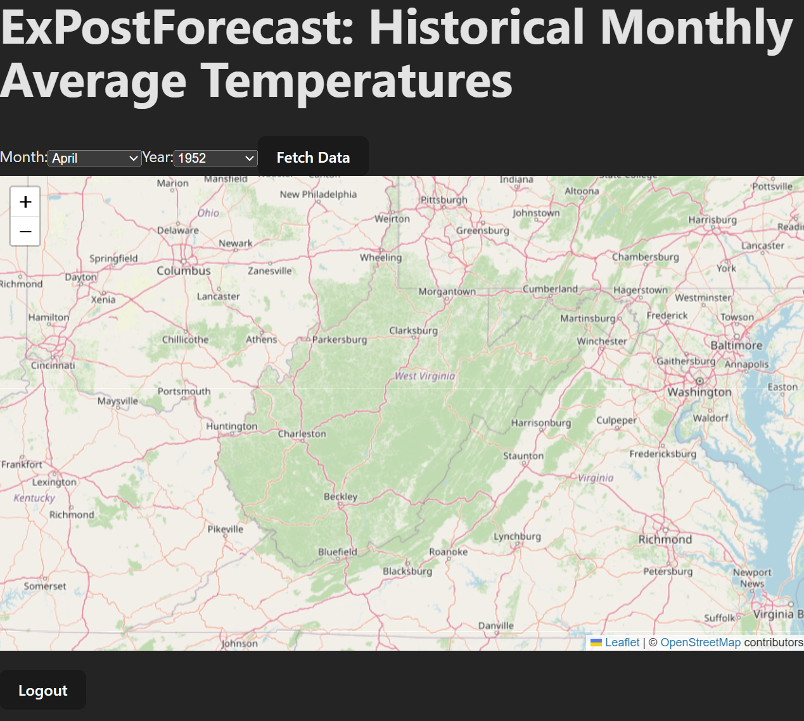

# Sprint 1: Frontend Setup Guide

Welcome to Sprint 1! **This `frontend/` folder is xPostForecast's own reference implementation** — a finished example you can read, run, and compare against. You will **not** clone or fork it. Instead, you'll create your own GitHub repository and build your own app, on your own topic, using the same tools and steps shown here.

In this phase, you'll scaffold a React front end using [Vite](https://vite.dev/), connect it to your own GitHub repo, and build out an interactive UI. This sprint focuses on learning how front-end development is structured and how modern dev tools help streamline the process.

---

## 🧰 What You’ll Learn

- How to scaffold and set up a Vite-powered React project from scratch
- Understanding the frontend folder and component structure
- How routing works using React Router
- How to run the local development server with hot reloading

---

## 1. 🔧 Prerequisites

Make sure the following are installed:

- [Node.js & npm](https://nodejs.org/en/) – JavaScript runtime and package manager. Install **Node.js 24 LTS**. Current Vite releases do not run on older versions such as Node 18.
- [Git](https://git-scm.com/downloads) – Version control  
- [VS Code](https://code.visualstudio.com/) – Recommended code editor
- A [GitHub](https://github.com/) account

---

## 2. 📖 Look at the Reference Example First

Before building your own app, skim this repo's `frontend/` folder on the [`sprint-1` branch](https://github.com/tdevine1/xPostForecast/tree/sprint-1) to see a complete Sprint 1 solution:

- `src/components/` – reusable UI pieces (`MapComponent.jsx`, `DateSelector.jsx`)
- `src/pages/` – full screens that compose components (`MapPage.jsx`)
- `src/App.jsx` / `src/main.jsx` – routing and entry point

You're not copying this code — you're building the *equivalent* structure for your own topic. Come back to this repo any time as a reference while you work.

---

## 3. 🆕 Create Your Own GitHub Repository

Follow your course's setup guide for the details (team naming, class organization, collaborators). In short:

1. **One teammate** creates the repository at [github.com/new](https://github.com/new), owned by the course organization, set to **Private**, with **Add a README file** checked and the **Node** `.gitignore` template selected. That template already ignores `node_modules/` and `.env` files (but not `.env.example`).
2. **Every teammate** clones it, either with VS Code's **Source Control → Clone Repository** or in a terminal (`` Ctrl+` ``):

   ```bash
   git clone https://github.com/<organization>/<your-repo-name>.git
   cd <your-repo-name>
   ```

---

## 4. 🏗️ Scaffold Your Project with Vite

From the **top level** of your cloned repo folder (the one containing `README.md`), run:

```bash
npm create vite@latest frontend -- --template react
cd frontend
```

This generates a new Vite + React project in a `frontend/` subfolder — mirroring how this reference repo separates `frontend/` from `backend/` (added in Sprint 2). Keep the app directly in `frontend/` (not nested deeper, such as `frontend/app/`): later sprints and the Sprint 4 deployment workflows assume `frontend/` and `backend/` sit side by side at the top of the repo. If the tool asks whether to install dependencies and start the dev server now, either answer is fine; if the server starts, stop it with `Ctrl+C` and continue.

Vite also generates a starter `.gitignore` inside `frontend/` covering `node_modules/`, `dist/`, and editor files, and sets up **oxlint** as the project's linter (`npm run lint`).

**Mini-Lesson: Why keep frontend and backend in separate folders?**  
Later sprints add a Node.js backend alongside your React frontend. Separating them from the start keeps dependencies, configs, and deployment concerns cleanly split.

---

## 5. 📦 Installing Dependencies

Still inside `frontend/`, install the packages you'll need. At minimum, for routing:

```bash
npm install react-router-dom
```

If your topic includes a map (like this example does, using [Leaflet](https://leafletjs.com/)), also install:

```bash
npm install leaflet react-leaflet
```

Pick libraries that fit *your* topic — a chart library (e.g. `chart.js`), a calendar picker, etc. are all reasonable substitutes depending on what your app needs to display.

---

## 6. 🧠 Structuring Your Project

Organize your `src/` folder the same way this reference example does:

```bash
frontend/
└── src/
    ├── components/     # Reusable pieces (your equivalents of MapComponent, DateSelector)
    ├── pages/          # Full screens tied to routes
    ├── App.jsx         # Main app routing component
    ├── main.jsx        # Entry point for rendering App
    └── index.css       # Global styles
```

**Mini-Lesson: Why split components and pages?**  
`components/` are reusable widgets (like buttons or selectors).  
`pages/` are full screens (like "MapPage") that use multiple components.

---

## 7. 🚀 Running the Development Server

In the terminal:

```bash
npm run dev
```

This launches the Vite development server. Your terminal will show something like:

```
  ➜  Local:   http://localhost:5173/
```

Visit that URL in your browser to see the app.

**Mini-Lesson: What is hot reloading?**  
When you edit a file, the page updates instantly without reloading. This is Vite’s superpower!

---

## 8. ✅ Lint and Test

Two habits worth starting now:

```bash
npm run lint   # oxlint: catches unused variables, hook mistakes, and similar bugs
```

This reference example also has a component test, `src/components/DateSelector.test.jsx`, run with [Vitest](https://vitest.dev/) via `npm test`, and a GitHub Actions workflow (`.github/workflows/ci.yml`) that runs lint, tests, and a build on every push. Check with your instructor whether tests are required for your project; either way, the files are a short, working example to copy from.

---

## 9. 🧪 What the Reference Example Looks Like

Here's a screenshot of *this reference app* at the end of Sprint 1 — yours will look different since it's your own topic, but should hit the same milestones:



By the end of Sprint 1, your own app should have:

- A working interactive UI element relevant to your topic (this example uses a Leaflet map)
- A selector/input UI for choosing what data to view (this example uses month/year dropdowns)
- Placeholder "Fetch Data" and "Logout" buttons — no real data fetch or login logic yet, that comes in later sprints

---

## 10. 🛠️ Troubleshooting

- **`npm install` fails or hangs** — delete `node_modules/` and `package-lock.json`, then re-run `npm install`. Make sure you're inside your `frontend/` folder when you run it.
- **`npm` or `node` not recognized** — Node.js isn't installed or isn't on your PATH. Reinstall Node.js and restart VS Code.
- **Errors mentioning an unsupported Node version** — run `node --version`; if it is older than v24, install Node.js 24 LTS.
- **`Port 5173 is already in use`** — another instance of the dev server is already running. Stop it (`Ctrl+C` in that terminal) or close other terminal tabs running `npm run dev`.
- **Blank page / component doesn't render** — open your browser's developer console (`F12`) and check for errors; a common cause is a typo in an import path under `src/components/`.

---

## 11. 💡 Explore More (Optional Learning)

| Topic | Resource |
|-------|----------|
| Learn JSX | [React: Writing Markup with JSX](https://react.dev/learn/writing-markup-with-jsx) |
| Learn React Router | [React Router: Declarative Mode](https://reactrouter.com/start/declarative/installation) |
| Learn Vite | [Vite Guide](https://vite.dev/guide/) |
| Learn Vitest | [Vitest Guide](https://vitest.dev/guide/) |

---

## ✅ You Now Have

- Created your own GitHub repository and cloned it locally
- Scaffolded a Vite React app of your own from scratch
- Installed dependencies and structured your project
- Built and previewed an interactive frontend for your own topic

In **Sprint 2**, we’ll add a backend connection and a database for login functionality.

Happy coding!

---

## 🛑 Don't Forget: Commit Your Work

Vite's scaffold adds a `.gitignore` in `frontend/` covering `node_modules/` and `dist/`, but **it does not exclude `.env`**. The repo-level `.gitignore` from GitHub's **Node** template does. If your repo was created without that template, add `.env` to a `.gitignore` yourself before you ever create one (you'll need one starting in Sprint 2 for settings like the backend URL and database credentials).

Before you `git add`, run `git status` and confirm nothing like `node_modules/` or a `.env` file is about to be committed.

```bash
git add .
git commit -m "Sprint 1: frontend setup"
git push
```
