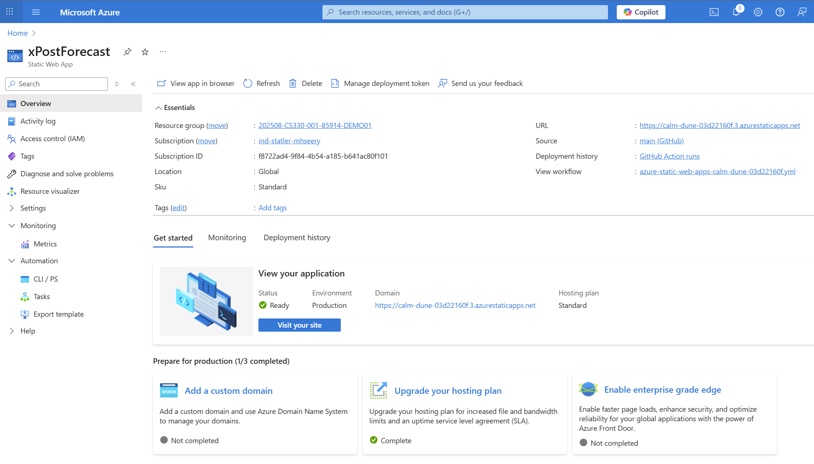
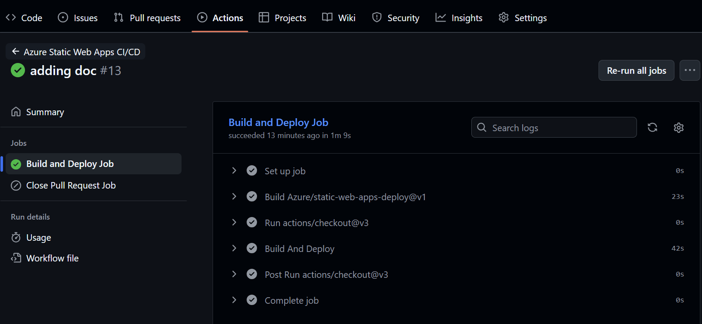
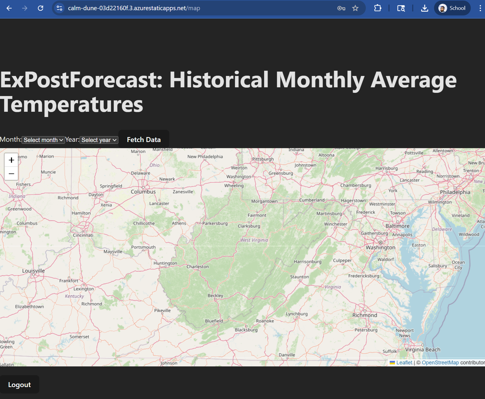

# Sprint 4 – Frontend Deployment (Azure Static Web Apps)
### Instructor-provisioned SWA: students configure, deploy, and verify

> This is the **reference implementation** for Sprint 4's frontend deployment. Deploy your own group's `frontend/` (from Sprints 1–3) using this as your worked example; don't clone or fork this one.

Your group's **Static Web App (SWA)** has already been created by the instructor. Your team will:

- Give the build the **backend URL** (`VITE_BACKEND_API_URL`)
- Add or fix the **deploy workflow**
- Add **`staticwebapp.config.json`** so refreshing a page works
- Verify that the deployed frontend talks to your cloud backend

How the frontend code works is covered in the [Sprint 3 frontend guide](https://github.com/tdevine1/xPostForecast/blob/sprint-3/frontend/README.md).

---

## 1. Prerequisites and Context

You should already have:

- A working React frontend in your repo's `frontend/` folder (adjust paths below if yours lives elsewhere)
- Your backend deployed to App Service and passing `/health` (see [`../backend/README.md`](../backend/README.md))

The instructor provides the SWA **name** and **URL** (e.g. `https://<name>.azurestaticapps.net`).

The SWA's **Overview** page shows its URL and the **Manage deployment token** button used below:



---

## 2. Two Ways to Deploy: Pick One

| | **A. Azure-generated workflow** | **B. This repo's workflow** |
|---|---|---|
| When | The instructor connected the SWA to your GitHub repo, so Azure committed `.github/workflows/azure-static-web-apps-<name>.yml` | You add the workflow yourself |
| Who builds the app | Azure's build service (Oryx), inside the action | Your workflow (`npm ci`, `npm test`, `npm run build`), then uploads `dist/` |
| Token secret | Created by Azure: `AZURE_STATIC_WEB_APPS_API_TOKEN_<NAME>` | You add `AZURE_STATIC_WEB_APPS_API_TOKEN` from **Manage deployment token** |
| Tests before deploy | No | Yes |

Either works. **Use only one**: two workflows would deploy every push twice. If you choose B and Azure generated a workflow, delete the generated file.

### Option A: fix the Azure-generated workflow

Open `.github/workflows/azure-static-web-apps-<name>.yml` and find the `Azure/static-web-apps-deploy@v1` step in `build_and_deploy_job`. Make sure it says:

```yaml
        with:
          azure_static_web_apps_api_token: ${{ secrets.AZURE_STATIC_WEB_APPS_API_TOKEN_<NAME> }}  # leave as generated
          repo_token: ${{ secrets.GITHUB_TOKEN }}
          action: "upload"
          app_location: "frontend"   # folder with the frontend's package.json
          api_location: ""           # no SWA-managed API; our backend is on App Service
          output_location: "dist"    # where Vite puts the build, relative to app_location
        env:
          VITE_BACKEND_API_URL: ${{ secrets.VITE_BACKEND_API_URL }}   # add this
```

- The `env:` block is easy to miss. Without it, the build has no backend URL and every API call fails.
- The generated file also has a `close_pull_request_job`. If VS Code's YAML validation complains that `app_location` is missing there, add the same `app_location: "frontend"` line to its `with:` block.
- If the Azure build fails with an unsupported Node.js version, switch to option B, where your workflow chooses the Node version.

### Option B: build in your own workflow (what this repo does)

Create `.github/workflows/deploy-frontend.yml` (this repo's [`deploy-frontend.yml`](../.github/workflows/deploy-frontend.yml)):

```yaml
name: Deploy frontend (Static Web Apps)

on:
  push:
    branches: [main]
    paths:
      - 'frontend/**'
      - '.github/workflows/deploy-frontend.yml'
  workflow_dispatch:

concurrency: deploy-frontend

jobs:
  build-test-deploy:
    runs-on: ubuntu-latest
    permissions:
      contents: read
    defaults:
      run:
        working-directory: frontend
    steps:
      - uses: actions/checkout@v7

      - uses: actions/setup-node@v7
        with:
          node-version: '24'
          cache: npm
          cache-dependency-path: frontend/package-lock.json

      # (this repo's file also has an `if:` that skips the job unless the repository variable
      #  DEPLOY_TO_AZURE is true, and a step that fails early if a secret is missing or the URL ends in /)

      - run: npm ci
      - run: npm test

      - name: Build
        run: npm run build
        env:
          VITE_BACKEND_API_URL: ${{ secrets.VITE_BACKEND_API_URL }}

      - name: Deploy to Azure Static Web Apps
        uses: Azure/static-web-apps-deploy@v1
        with:
          azure_static_web_apps_api_token: ${{ secrets.AZURE_STATIC_WEB_APPS_API_TOKEN }}
          action: upload
          app_location: frontend/dist
          skip_app_build: true
```

`skip_app_build: true` tells the action the app is already built, so `app_location` points at the finished `dist/` folder.

Get the token: Azure Portal → your Static Web App → **Manage deployment token** → copy. Add it as the repository secret `AZURE_STATIC_WEB_APPS_API_TOKEN` (next step).

---

## 3. Add the Secrets

In your GitHub repo: **Settings → Secrets and variables → Actions → New repository secret**.

| Name | Value | Needed for |
|---|---|---|
| `VITE_BACKEND_API_URL` | `https://<your-backend>.azurewebsites.net` (**no trailing slash**) | A and B |
| `AZURE_STATIC_WEB_APPS_API_TOKEN` | the SWA deployment token | B only (A uses Azure's generated secret) |


*(This screenshot shows secrets generated by Azure for option A. With option B, the token secret is named `AZURE_STATIC_WEB_APPS_API_TOKEN`.)*

**Why the URL is needed at build time:** Vite replaces `import.meta.env.VITE_BACKEND_API_URL` with the actual text of the URL while building. The deployed site is just static files, so there's no server-side environment to read later. Change the URL → rebuild.

**Is the URL secret?** Not really: it ends up in the JavaScript anyone can download. Storing it as a secret is simply a convenient place to keep it out of the code. Never put real secrets (passwords, keys) in a `VITE_` variable.

---

## 4. Make Page Refreshes Work: `staticwebapp.config.json`

SWA serves files. A request for `/map` looks for a file named `map`, finds none, and returns **404**, even though React Router knows the `/map` page. The fix is a config file that sends unknown paths to `index.html`:

`frontend/public/staticwebapp.config.json`:

```json
{
  "navigationFallback": {
    "rewrite": "/index.html",
    "exclude": ["/assets/*", "/*.{svg,png,ico,json}"]
  }
}
```

Vite copies everything in `public/` into `dist/`, so the file is deployed with the site. `exclude` keeps real files (scripts, images) from being rewritten.

---

## 5. Deploy

Commit and push to `main`:

```bash
git add .
git commit -m "Sprint 4: deploy frontend to Azure Static Web Apps"
git push
```

Watch the **Actions** tab. When the deploy workflow is green, the site is live.



---

## 6. Cookies Between Two Sites

The deployed frontend (`*.azurestaticapps.net`) and backend (`*.azurewebsites.net`) are **different sites**. That affects the login cookie:

- Browsers only include a cookie in **cross-site** requests if it is marked `SameSite=None` **and** `Secure`.
- The backend does this when its App Service setting `NODE_ENV` is `production`: the cookie becomes `HttpOnly; Secure; SameSite=None; Partitioned`. `Partitioned` ties the cookie to your frontend's site, which lets it work in browsers that restrict third-party cookies.
- The frontend already sends cookies on every request (`withCredentials: true` in `src/api.js`), and the backend's CORS allows exactly `FRONTEND_URL` with credentials.

If login returns 200 but the next request is `401`, the cookie isn't being sent: check `NODE_ENV=production` and `FRONTEND_URL` on the App Service. Some browsers or strict privacy settings block cross-site cookies even so. If login works in one browser but not another, that's the likely cause. The complete fix is to serve the frontend and backend from the same site (for example custom domains `app.example.edu` and `api.example.edu`); ask your instructor.

---

## 7. Verify the Deployed Frontend

Visit `https://<your-swa>.azurestaticapps.net` with the browser's developer tools open (F12).

- **Console**: `Frontend API Base URL: https://<your-backend>.azurewebsites.net`. If it says `undefined`, the build didn't get `VITE_BACKEND_API_URL` (step 2 or 3).
- **Login**: works, and in the **Network** tab requests go to `https://<your-backend>.azurewebsites.net/auth/...` with no CORS errors.
- **Refresh on `/map`**: you stay on the map (no 404, no bounce to login).
- **Fetch Data**: temperatures appear (any month from 1895 to September 2022).
- **Logout**: back to `/login`.



---

## 8. Troubleshooting

| Symptom | Likely cause | Fix |
|---|---|---|
| Console shows `Frontend API Base URL: undefined` | Build didn't receive the URL | Option A: add the `env:` block; both: check the secret name |
| Requests go to `…/undefined/auth/login` or to the SWA's own URL | Same as above | Same as above |
| `404` when refreshing `/map` or `/login` | Missing `staticwebapp.config.json` | Add it to `frontend/public/` (step 4) |
| CORS error in the console | Backend `FRONTEND_URL` ≠ SWA URL | Set it to the exact SWA URL, no trailing slash |
| Login succeeds, then immediately logged out / `401` | Cookie not sent cross-site | Backend `NODE_ENV=production` (step 6) |
| Workflow error about the deployment token | Wrong or missing token secret | Copy it again from **Manage deployment token** |
| Deploy step says the app directory location is invalid | Option A: `app_location` doesn't point at the folder with `package.json`. Option B: the build didn't produce `frontend/dist` | Fix the path; for B, check the Build step's log |
| Every push deploys twice | Both an Azure-generated and your own workflow | Keep one (section 2) |

---

## 9. Summary

Your team has:

- Deployed the React app to the instructor-provisioned Static Web App with GitHub Actions
- Supplied the backend URL at build time with `VITE_BACKEND_API_URL`
- Made client-side routes survive a refresh with `staticwebapp.config.json`
- Verified login, data, and cookies across two sites in the live app

Together with the backend guide, your group now has a complete cloud-hosted application.
