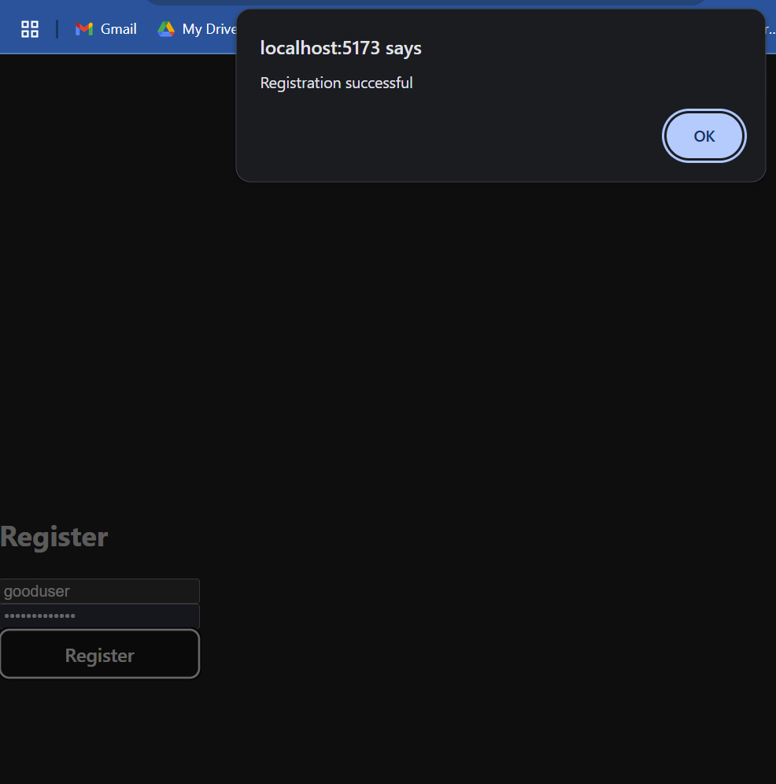

# Sprint 2: Authentication & Backend Integration for xPostForecast

In **Sprint 2**, we build upon Sprint 1’s frontend by adding a secure backend and authentication flow. Students will learn how to connect a React/Vite front end to an Express/MySQL backend deployed on Azure, implement login & registration, and protect routes with JWT stored in HTTP-only cookies.

---

## 🎯 Goals of Sprint 2

- **Backend Setup**: Scaffold an Express.js app with routes for `/register` and `/login`.
- **Database Integration**: Connect to an Azure Database for MySQL using `mysql2` and SSL.
- **Secure Authentication**:
  - Hash passwords with `bcryptjs`.
  - Issue JWTs on login and store them in HTTP-only cookies.
- **Frontend Integration**:
  - Create `Login.jsx` and `Register.jsx` pages.
  - Update `App.jsx` to manage `authenticated` state and guard the `/map` route.

---

## 🔄 What’s Different from Sprint 1

| Feature           | Sprint 1                       | Sprint 2                                              |
| ----------------- | ------------------------------ | ----------------------------------------------------- |
| Project Scope     | Frontend only (map & selector) | Full-stack: frontend & backend                        |
| Routing           | Single `/map` route            | `/login`, `/register`, `/map` with redirects          |
| Backend           | None                           | Express.js app under `backend/`                       |
| Database          | N/A                            | Azure MySQL with SSL (`backend/config/database.js`)   |
| Auth              | Stub (Fetch Data button)       | Real login & registration with JWT                    |
| State Persistence | Local component state          | `authenticated` persisted in `localStorage` + cookies |

---

## 📁 Folder Structure

```bash
sprint2-login-backend/
├── backend/                      # Express & MySQL backend
│   ├── config/
│   │   └── database.js           # MySQL pool + SSL setup
│   ├── controllers/
│   │   └── authController.js     # register & login logic
│   ├── routes/
│   │   └── auth.js               # Express routes for auth
│   ├── middleware/               # (future JWT-protection)
│   ├── .env.example              # sample env vars for DB & JWT
│   └── index.js                  # server entry point
│
├── frontend/                     # Vite + React frontend
│   ├── src/
│   │   ├── pages/
│   │   │   ├── Login.jsx         # Login form
│   │   │   ├── Register.jsx      # Registration form
│   │   │   └── MapPage.jsx       # Protected map view
│   │   ├── components/
│   │   │   ├── DateSelector.jsx  # Date dropdowns
│   │   │   └── MapComponent.jsx  # Leaflet map
│   │   ├── App.jsx               # Routing & auth state
│   │   └── main.jsx              # Vite entry point
│   ├── package.json              # scripts & dependencies
│   └── vite.config.js            # dev server config
└── README.md                     # (this overview)
```

---

## 🛠 Setup Guides

Detailed, step-by-step setup instructions are available in the separate README files for each layer:

- **Backend** configuration and startup: see `backend/README.md`
- **Frontend** configuration and startup: see `frontend/README.md`

These guides cover installation, environment variables, dependency setup, and running the servers locally.

## 🧪 Test Authentication Flow

1. **Register**: Navigate to `/register`, enter a new username and password.
2. **Login**: After successful registration, log in at `/login`.
3. **Access Map**: You should be redirected to `/map` and see the map (with stubs).
4. **Logout**: (if implemented) Clear session and return to `/login`.

## 🔍 Login & Registration Walkthrough

**Login Failure**\
Attempting to log in with an invalid user yields an error:


**Registration Success**\
When a new username is provided and the form is submitted, students should see a confirmation alert:



**Logging In**\
On the Login page, entering valid credentials redirects to the protected map view:

Note the login should be persisted if you close the window and try again. To clear the state, use the Logout button!

## 📚 Further Resources

- **Express.js**: [https://expressjs.com/](https://expressjs.com/)
- **MySQL & mysql2**: [https://github.com/mysqljs/mysql2](https://github.com/mysqljs/mysql2)
- **bcryptjs**: [https://github.com/dcodeIO/bcrypt.js](https://github.com/dcodeIO/bcrypt.js)
- **jsonwebtoken**: [https://github.com/auth0/node-jsonwebtoken](https://github.com/auth0/node-jsonwebtoken)
- **Vite**: [https://vitejs.dev/guide/](https://vitejs.dev/guide/)
- **React Router**: [https://reactrouter.com/](https://reactrouter.com/)

---

You’re now set up with a full-stack authentication system! In Sprint 3, we’ll deploy the frontend to Azure Static Web Apps.

