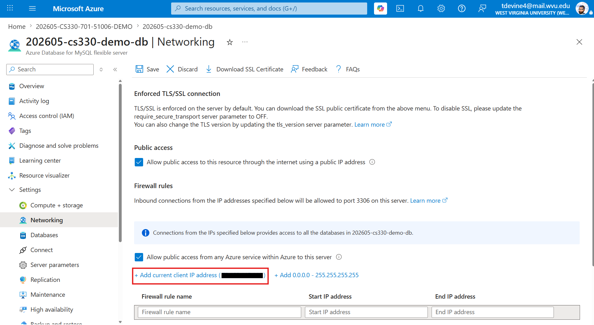
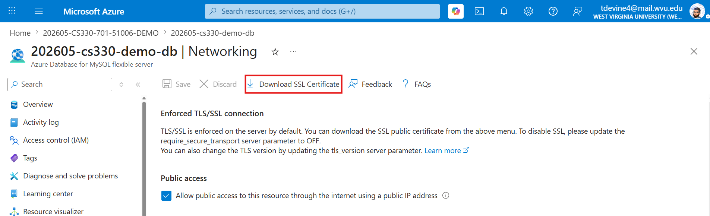

# Sprint 2 Backend: Setup & Database Integration Guide

In **Sprint 2**, you build your first backend: an Express.js server that handles user authentication and connects securely to an **Azure MySQL** database over **TLS/SSL**. This guide reflects the **current repo** (ESM modules, `mysql2/promise`, **cookie‑based JWT auth**, and **email on registration**).

> This README applies to the `sprint2-login-backend/backend` folder — the **reference implementation**. Build the equivalent `backend/` in your own project repo; don't clone or fork this one.

---

## 🖼️ Visual Overview

*High‑level flow: React (Vite) ⇄ Cookie‑based auth ⇄ Express ⇄ Azure MySQL (TLS)*

---

## 📂 Backend Folder Structure

```bash
backend/
├── config/
│   ├── database.js                      # MySQL pool + SSL setup
│   └── DigiCertGlobalRootG2.crt.pem     # SSL certificate from Azure
├── middleware/
│   └── authMiddleware.js                # JWT cookie verification
├── routes/
│   └── auth.js                          # /auth routes: register, login, test, logout
├── server.js                            # app entry (CORS, cookies, routes)
└── .env.example                         # sample env vars
```

---

## 🛠 Prerequisites

- **Node.js** 20.19+
- **`mysql` command-line client** (see Step 4 below for install instructions — no VS Code extension needed)
- **Azure Database for MySQL – Flexible Server**
- Your public IP allowed in **Azure → Networking → Firewall rules**



---

## 1) Clone & Install

```bash
cd sprint2-login-backend/backend
npm install
```

---

## 2) Configure Environment Variables

1) Copy sample and edit:
```bash
cp .env.example .env
```

2) Edit `.env` with your Azure MySQL details and frontend/backend settings:

```ini
DB_HOST=<your-server>.mysql.database.azure.com
DB_USER=<your-admin-user>
DB_PASSWORD=<your-password>
DB_NAME=authdb
DB_PORT=3306

FRONTEND_URL=http://localhost:5173
BACKEND_PORT=5175

JWT_SECRET=<run the node crypto command to generate>
NODE_ENV=development
```

> **Do not commit** `.env` (already in `.gitignore`).

**Generate a JWT secret** (one‑liner):
```bash
node -e "console.log(require('crypto').randomBytes(32).toString('hex'))"
```

---

## 3) Download the SSL Certificate from Azure

Use the certificate provided **by Azure** (not directly from DigiCert).

1. Go to the **Azure Portal** → your **MySQL Flexible Server**
2. Open **Networking**
3. Click **Download SSL Certificate**



Move/rename it to your project:

```bash
# Example
mv ~/Downloads/DigiCertGlobalRootG2.crt.pem sprint2-login-backend/backend/config/DigiCertGlobalRootG2.crt.pem
```

> The backend reads this CA file to validate TLS to Azure.

---

## 4) Connect and Verify (`mysql` CLI)

Before wiring up your codebase, confirm you can actually reach the database from the command line. VS Code's integrated terminal works fine for this — you don't need a database extension. Since you haven't created the `authdb` database yet, connect to the default `mysql` database first; you'll create `authdb` and the `users` table from there.

**Install the `mysql` client, if you don't already have it:**

| OS | Command |
|---|---|
| Windows | `winget install Oracle.MySQL` (or download the "MySQL Command Line Client" from [dev.mysql.com](https://dev.mysql.com/downloads/mysql/)) |
| macOS | `brew install mysql-client` then add it to your PATH (`brew info mysql-client` shows the exact path) |
| Linux (Debian/Ubuntu) | `sudo apt install mysql-client` |

> **Windows note:** `winget install Oracle.MySQL` adds `mysql` to your system PATH, but the terminal you installed it from won't pick up that change. **Fully close and reopen VS Code** (closing just the terminal panel isn't enough — restart the whole app) before trying `mysql --version`. If it still isn't found after restarting, open a new Command Prompt and confirm `mysql` runs there first — if it doesn't, the install added it to PATH for new sessions only, so you may need to log out/back in, or manually add the MySQL `bin` folder (typically `C:\Program Files\MySQL\MySQL Server 9.x\bin`) to your PATH.

Verify it installed:

```bash
mysql --version
```

**Connect to your Azure server:**

```bash
mysql -h <your-server>.mysql.database.azure.com \
  -u <your-admin-user> -p \
  --ssl-ca=sprint2-login-backend/backend/config/DigiCertGlobalRootG2.crt.pem
```

You'll be prompted for your password. These are the same `DB_HOST` / `DB_USER` / `DB_PASSWORD` values you put in `.env` — if this connects, your app's connection will work too.

**Once connected, verify with a few basic commands:**

```sql
SHOW DATABASES;
SELECT CURRENT_USER();
```

Type `exit` or press `Ctrl+D` to leave the `mysql` shell.

---

## 5) Create the `users` Table (with email)

Still connected via the `mysql` CLI, run:

```sql
CREATE DATABASE IF NOT EXISTS authdb;
USE authdb;

CREATE TABLE IF NOT EXISTS users (
  id INT AUTO_INCREMENT PRIMARY KEY,
  email VARCHAR(255) NOT NULL UNIQUE,
  username VARCHAR(255) NOT NULL UNIQUE,
  password_hash VARCHAR(255) NOT NULL,
  created_at TIMESTAMP DEFAULT CURRENT_TIMESTAMP
);
```

> Registration requires **email + username + password**.

---

## 6) Run the Backend

```bash
# From backend/ directory
node server.js
```

**Expected output:**
```
Configured FRONTEND_URL= http://localhost:5173
Successfully connected to MySQL
Server is running on 5175
```

---

## 7) Test the Auth Routes

All routes are mounted under `/auth`:

- **Register** `POST /auth/register` → `{ email, username, password }`
- **Login** `POST /auth/login` → sets HTTP‑only cookie
- **Verify** `GET /auth/test` → returns `{ ok: true, user }` if cookie valid
- **Logout** `POST /auth/logout` → clears cookie

**Curl examples (dev only):**

```bash
# Register
curl -i -X POST http://localhost:5175/auth/register \
  -H "Content-Type: application/json" \
  --data '{"email":"a@b.com","username":"alice","password":"pass123"}'

# Login
curl -i -X POST http://localhost:5175/auth/login \
  -H "Content-Type: application/json" \
  --data '{"username":"alice","password":"pass123"}' \
  -c cookies.txt

# Test (uses cookie)
curl -i http://localhost:5175/auth/test -b cookies.txt

# Logout
curl -i -X POST http://localhost:5175/auth/logout -b cookies.txt
```

---

## 🔐 CORS & Cookies (Important)

Enable CORS with **credentials** and parse cookies:

```js
// server.js
app.use(cors({ origin: process.env.FRONTEND_URL, credentials: true }));
app.use(express.json());
app.use(cookieParser());
app.use('/auth', authRoutes);
```

In React (frontend), always include credentials for protected calls:

```js
axios.get(`${VITE_API_URL}/auth/test`, { withCredentials: true });
```

---

## 🧭 Troubleshooting

| Symptom | Likely Cause | Fix |
|---|---|---|
| `403 /auth/test` on first load | No cookie yet | This is normal before login |
| `404 /login` | Missing `/auth` prefix | Use `/auth/login` and `/auth/register` |
| CORS error / cookie not set | Missing `credentials: true` or wrong `FRONTEND_URL` | Set both on server and client |
| `ER_NO_DEFAULT_FOR_FIELD 'email'` | Table requires email but request didn’t send it | Add email to frontend + INSERT |
| SSL errors | Wrong CA path | Ensure `config/DigiCertGlobalRootG2.crt.pem` path |
| `mysql: command not found` (right after installing) | PATH updated, but current terminal/VS Code session hasn't picked it up | **Fully restart VS Code** (not just the terminal panel), or open a fresh Command Prompt window |
| `mysql: command not found` (still, after restart) | Client not installed, or install didn't update PATH | Reinstall using the table in Step 4; verify manually in a new Command Prompt before retrying in VS Code |
| `ERROR 2002` / connection timed out | Firewall rule missing or wrong host | Add your IP in Azure → Networking; double-check `DB_HOST` |
| `Access denied for user` | Wrong username/password | Azure admin usernames sometimes need `@<server-name>` suffix on older server versions — check the **Connect** page in the Azure Portal for your exact format |
| `ERROR 2026 (HY000): TLS/SSL error` | Wrong or missing `--ssl-ca` path | Confirm the path passed to `--ssl-ca` matches where you saved `DigiCertGlobalRootG2.crt.pem` |

---

## 📚 References

- Express: https://expressjs.com/
- mysql2: https://github.com/sidorares/node-mysql2
- jsonwebtoken: https://github.com/auth0/node-jsonwebtoken
- bcryptjs: https://github.com/dcodeIO/bcrypt.js
- MDN CORS: https://developer.mozilla.org/docs/Web/HTTP/CORS
