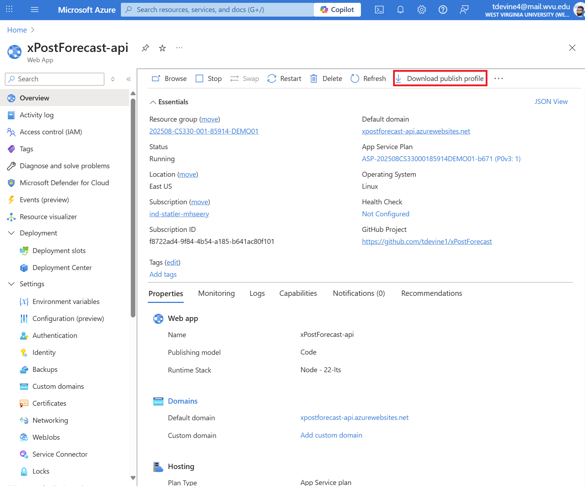
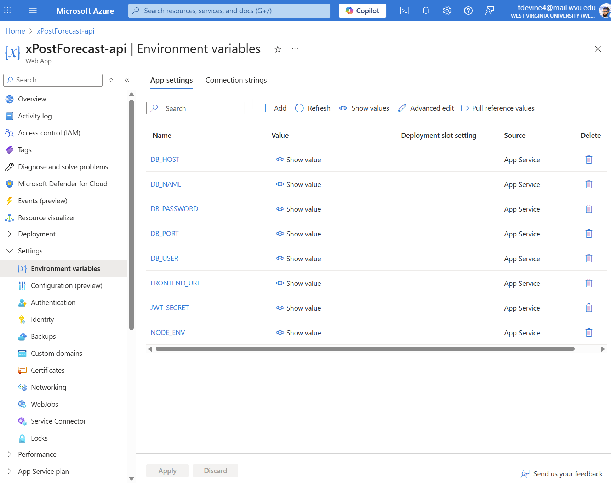
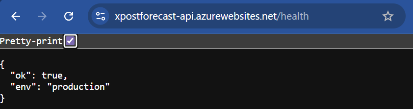
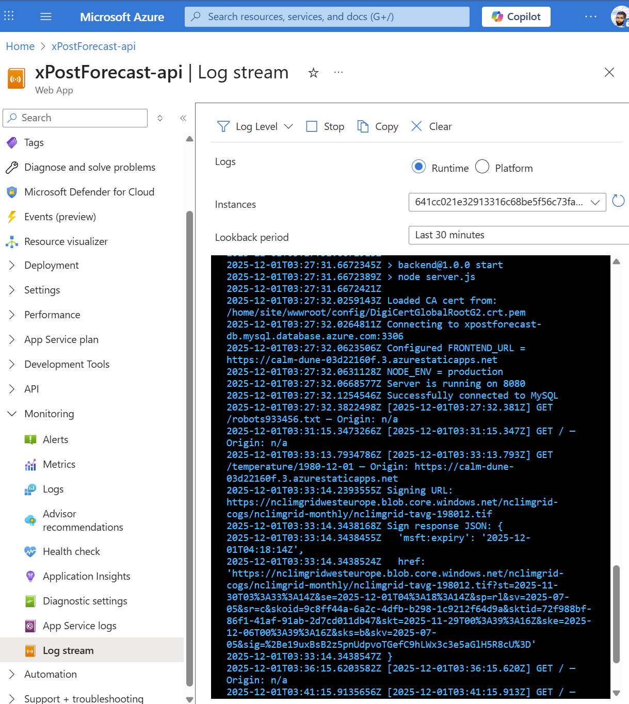

# Sprint 4 – Backend Deployment (Azure App Service)
### Instructor-provisioned App Service – students configure, deploy, and verify

Your group’s **Azure App Service (Web App for Linux)** for the backend has already been created by the instructor.

It is your team’s responsibility to:

- Configure the App Service’s **Application Settings** (environment variables)  
- Connect it to your existing **Azure MySQL database** from Sprint 2  
- Set up **GitHub Actions** with a publish profile  
- Verify the deployment and health status  

---

## 1. Prerequisites and Context

You have:

- A Node.js backend in `sprint4-cloud-deployment/backend`  
- A working database on Azure MySQL (same host / DB / user as earlier sprints)  
- A corresponding App Service created for your group  

The instructor will provide:

- The **App Service name**  
- The **App Service URL** (e.g., `https://xpostforecast-api.azurewebsites.net`)  
- The **MySQL host** and **database name** (already used in Sprints 2 & 3)  

You do **not** create or delete App Services or MySQL servers in this sprint.

---

## 2. Download the Publish Profile and Add as GitHub Secret

GitHub Actions uses the App Service **publish profile** to authenticate deployments.

### 2.1 Download the Publish Profile

1. Open Azure Portal.  
2. Navigate to **App Services → [your group’s App Service]**.  
3. In the left menu, find **Deployment Center** (or “Get publish profile”).  
4. Click **Download publish profile**.

This downloads an XML file (e.g., `yourappname.PublishSettings`).

Screenshot reference:



---

### 2.2 Add the Publish Profile as a GitHub Secret

1. Go to your GitHub repository.  
2. Click **Settings → Secrets and variables → Actions**.  
3. Click **New repository secret**.  
4. Add:

```text
Name:  APP_SERVICE_PUBLISH_PROFILE
Value: (paste the entire XML file contents)
```

Click **Add secret**.

Screenshot reference:


---

## 3. Inspect and Fix the Backend GitHub Actions Workflow

Azure may have generated an App Service workflow or you may create one yourself, typically in:

```text
.github/workflows/backend-appservice.yml
```

Your goal is to ensure that:

- It builds from `sprint4-cloud-deployment/backend`  
- It deploys that folder to App Service  
- It uses the `APP_SERVICE_PUBLISH_PROFILE` secret  

### 3.1 Example Backend Workflow Skeleton

A typical structure might look like:

```yaml
name: Build and deploy Node.js app to Azure Web App - xPostForecast-api

on:
  push:
    branches:
      - main

jobs:
  build:
    runs-on: ubuntu-latest
    steps:
      - uses: actions/checkout@v4

      - name: Set up Node.js version
        uses: actions/setup-node@v3
        with:
          node-version: "20.x"

      - name: npm install, build, and test (backend only)
        working-directory: sprint4-cloud-deployment/backend
        run: |
          npm install
          npm run build --if-present
          # Optional: comment out if you have no tests
          # npm run test --if-present

      - name: Upload backend artifact for deployment
        uses: actions/upload-artifact@v4
        with:
          name: backend-app
          path: sprint4-cloud-deployment/backend

  deploy:
    runs-on: ubuntu-latest
    needs: build
    steps:
      - name: Download backend artifact
        uses: actions/download-artifact@v4
        with:
          name: backend-app
          path: sprint4-cloud-deployment/backend

      - name: Deploy to Azure Web App
        uses: azure/webapps-deploy@v3
        with:
          app-name: "<your-appservice-name>"
          slot-name: "Production"
          package: sprint4-cloud-deployment/backend
          publish-profile: ${{ secrets.APP_SERVICE_PUBLISH_PROFILE }}
```

Adjust the `app-name` to match the actual name of your App Service.

---

### 3.2 Common Fixes You May Need

1. **Working Directory / Paths**  
   If the workflow originally assumed `./backend`, change it to:

   - `working-directory: sprint4-cloud-deployment/backend`
   - `path: sprint4-cloud-deployment/backend`
   - `package: sprint4-cloud-deployment/backend`

   Otherwise, the workflow may fail with errors like:

   > “No such file or directory, working directory './backend'”

2. **Test Command Failures**  
   If your `package.json` includes:

   ```json
   "test": "echo \"Error: no test specified\" && exit 1"
   ```

   then `npm test` will cause the workflow to fail. You can either:

   - Comment out the `npm run test --if-present` line in the workflow, or  
   - Temporarily change the `test` script in `backend/package.json` to something that exits successfully.

3. **Node Version Alignment**  
   Ensure `node-version` in the workflow matches the Node version configured on App Service (e.g., Node 20 LTS).

---

### 3.3 How the Backend Port Works on Azure App Service

Azure App Service does **not** allow Node.js applications to choose their own port.
Instead, the platform assigns a port dynamically at runtime and exposes it through an environment variable named:

PORT

Your backend **must** listen on this assigned port. If it attempts to bind to any other port (such as 5175), the application will fail to start on Azure.

Example code used in the backend:

    const PORT = Number(process.env.PORT) || 5175;
    app.listen(PORT, () => {
      console.log(`Server running on port ${PORT}`);
    });

Explanation:

- When running **locally**, process.env.PORT is usually undefined, so the backend defaults to port 5175.
- When running **on Azure App Service**, the platform injects a required port value (commonly 8080).
- Your application must listen on that Azure-provided port or it will not boot.

This is why the backend code uses process.env.PORT instead of hard-coding any port number.

Screenshot reference:


---

## 4. Configure App Service Application Settings (Environment Variables)

Now configure how the backend connects to the database and interacts with the frontend.

### 4.1 Open Application Settings

1. In Azure Portal, open your group’s App Service.  
2. In the left menu, click **Configuration → Application settings**.

Screenshot reference:



### 4.2 Required Settings

Add or verify the following keys (exact names may be instructor-specified):

| Name          | Description                                                     |
|---------------|-----------------------------------------------------------------|
| `DB_HOST`     | Your MySQL host (`<server>.mysql.database.azure.com`)           |
| `DB_USER`     | Database username (same used locally in Sprint 2/3)             |
| `DB_PASS`     | Database password                                               |
| `DB_NAME`     | Database name for your team                                     |
| `FRONTEND_URL`| Your SWA URL (`https://<your-swa>.azurestaticapps.net`)         |
| `JWT_SECRET`  | A long random string used for signing JWTs                      |
| `NODE_ENV`    | `production`                                                   |

Click **Save**, then **Restart** the App Service.

---

## 5. Database Connectivity Notes

- The Azure MySQL server and database were created and configured during Sprint 2.  
- You do **not** modify MySQL firewall rules in this sprint unless instructed otherwise.  
- If the backend logs show `Error: connect ETIMEDOUT` when connecting to MySQL, inform your instructor (this usually indicates a network or firewall issue at the server level).

From your code’s perspective, the critical items are:

- Correct `DB_HOST` value  
- Valid username / password  
- Correct `DB_NAME`  

---

## 6. Verify Backend Health

After deploying and configuring environment settings, verify that your backend is running correctly.

### 6.1 Use the `/health` Endpoint

In a browser or tool like `curl`, visit:

```text
https://<your-backend>.azurewebsites.net/health
```

A healthy server will respond with JSON similar to:

```json
{
  "ok": true,
  "env": "production"
}
```

Screenshot reference:



---

### 6.2 Check Log Stream During Startup

For deeper debugging:

1. Go to your App Service in Azure Portal.  
2. Navigate to **Log stream**.  
3. Restart the App Service and watch the logs.

You should see messages along the lines of:

```text
Loaded CA cert from: /home/site/wwwroot/config/DigiCertGlobalRootG2.crt.pem
Connecting to xpostforecast-db.mysql.database.azure.com:3306
Configured FRONTEND_URL = https://<your-swa>.azurestaticapps.net
NODE_ENV = production
Server is running on 8080
```

Screenshot reference:



If there are errors:

- Check env var names and values  
- Confirm database host/user/password  
- Confirm your publish profile secret is valid and up to date  

---

## 7. Summary of Backend Tasks


browser-backend-success.png

By following this README, your team will:

- Download and use the App Service **publish profile** to authenticate deployments via GitHub Actions  
- Fix and confirm a backend workflow that builds from `sprint4-cloud-deployment/backend`  
- Configure **Application Settings** for database connection and frontend URL  
- Confirm the backend is up and healthy at `/health`  
- Use the Azure Log Stream to debug real startup / connection issues  

When combined with the SWA instructions in `../frontend/README.md`, your group will have a complete cloud-hosted application for xPostForecast running on Azure.
