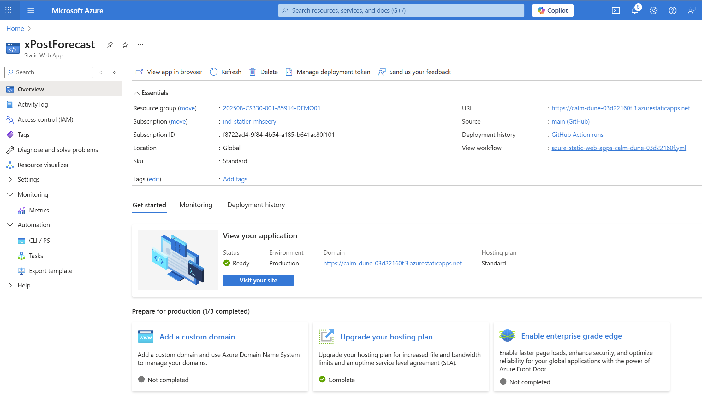
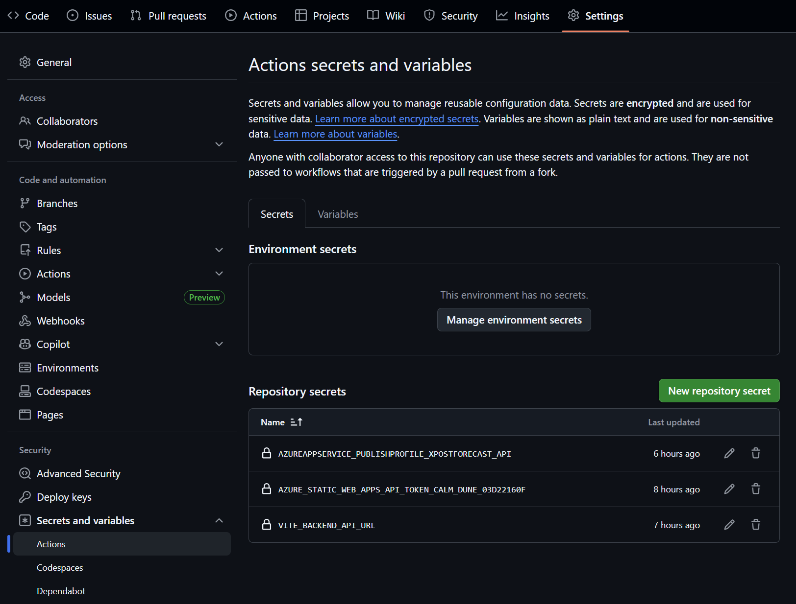
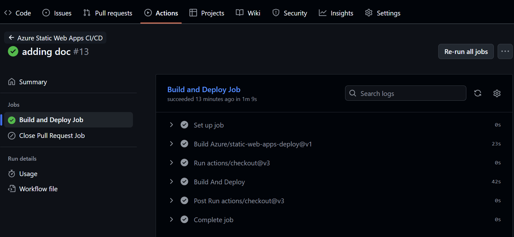
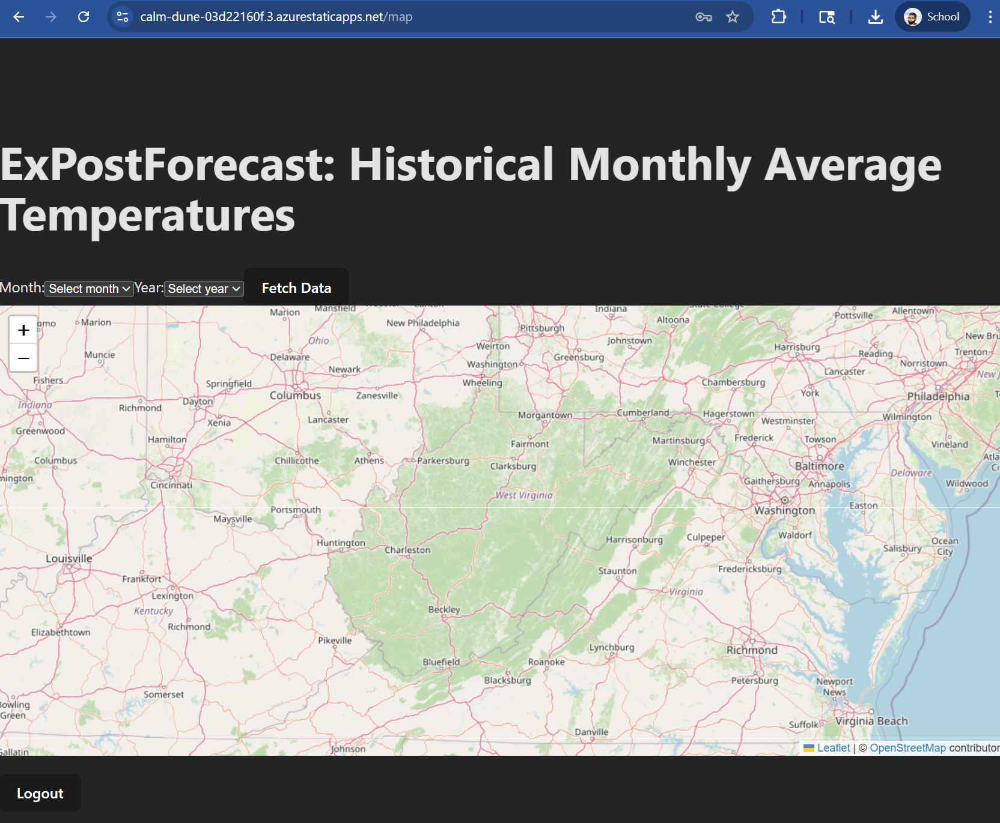

# Sprint 4 – Frontend Deployment (Azure Static Web Apps)
### Instructor-provisioned SWA – students configure, deploy, and verify

Your group’s **Static Web App (SWA)** has already been created by the instructor and linked to your GitHub repository.

Your job in this sprint is to:

- Configure the **backend API URL** as a GitHub Actions secret  
- Confirm and, if necessary, fix the **SWA GitHub Actions workflow**  
- Trigger deployments via pushes to `main`  
- Verify that the deployed frontend talks to your cloud backend

---

## 1. Prerequisites and Context

You should already have:

- A working React frontend from earlier sprints
- A backend API being deployed to Azure App Service (see `../backend/README.md`)
- An existing MySQL database that your backend can reach from the cloud

Your instructor will provide per-group:

- The SWA **Name**  
- The SWA **URL** (e.g., `https://group3-swa.azurestaticapps.net`)  

You do **not** create or delete SWA resources in this sprint.

Screenshot reference:


---

## 2. Inspect the SWA GitHub Actions Workflow

When the instructor first created and linked the SWA, Azure created a workflow file in your repo, similar to:

```text
.github/workflows/azure-static-web-apps.yml
```

Open this file and locate the main deploy job where `Azure/static-web-apps-deploy@v1` is used.

### 2.1 Verify `app_location` and `output_location`

Ensure these match the Sprint 4 frontend layout:

```yaml
with:
  app_location: "sprint4-cloud-deployment/frontend"
  api_location: ""
  output_location: "dist"
```

- `app_location` should point to the **frontend** code folder for Sprint 4.
- `output_location` is where Vite places the built files (`dist` by default).
- `api_location` is not used in this project (we are using a separate App Service for the backend), so it is left empty.

If these paths are incorrect, update them and commit to `main`.

Screenshot reference:



---

### 2.2 Fix the “Close Pull Request” Job (If Needed)

Some auto-generated SWA workflows include a job like:

```yaml
close_pull_request_job:
  if: github.event_name == 'pull_request' && github.event.action == 'closed'
  runs-on: ubuntu-latest
  steps:
    - name: Close Pull Request
      uses: Azure/static-web-apps-deploy@v1
      with:
        azure_static_web_apps_api_token: ${{ secrets.AZURE_STATIC_WEB_APPS_API_TOKEN_* }}
        action: "close"
```

VS Code or GitHub Actions may complain that `app_location` is missing here. If that happens, add the same `app_location` used in your main job:

```yaml
with:
  azure_static_web_apps_api_token: ${{ secrets.AZURE_STATIC_WEB_APPS_API_TOKEN_* }}
  app_location: "sprint4-cloud-deployment/frontend"
  action: "close"
```

This keeps the workflow consistent and avoids YAML validation errors.

---

## 3. Add the Backend URL Secret (`VITE_BACKEND_API_URL`)

The frontend uses Axios and Vite, with the backend API URL coming from `import.meta.env.VITE_BACKEND_API_URL` at build time.

You’ll set this via a GitHub Actions secret.

### 3.1 Create the Secret in GitHub

1. Go to your repo on GitHub.  
2. Click **Settings → Secrets and variables → Actions**.  
3. Click **New repository secret**.  
4. Add:

```text
Name:  VITE_BACKEND_API_URL
Value: https://<your-appservice>.azurewebsites.net
```

> Make sure there is **no trailing slash** at the end of the URL.  
> The frontend will append routes like `/auth/login` to this base.

Screenshot reference:



---

### 3.2 Wire the Secret into the SWA Workflow (if needed)

Depending on how Azure generated your workflow, you may need to explicitly pass the secret into the job environment:

Inside the deploy job (usually under `jobs: build_and_deploy_job`), add:

```yaml
env:
  VITE_BACKEND_API_URL: ${{ secrets.VITE_BACKEND_API_URL }}
```

This ensures that when Vite runs the build, `process.env.VITE_BACKEND_API_URL` / `import.meta.env.VITE_BACKEND_API_URL` is set correctly.

---

## 4. Local Frontend Sanity Check (Optional but Recommended)

Before relying on Azure, confirm your frontend still runs locally.

From the repo root:

```bash
cd sprint4-cloud-deployment/frontend
npm install
npm run dev
```

You should see something like this logged in your browser console or terminal:

```text
Frontend API Base URL: http://localhost:5175
```

This indicates that locally your Vite dev server is pointing to your **local** backend (not the cloud backend). That’s fine; for Azure, the build process uses the `VITE_BACKEND_API_URL` secret instead.

---

## 5. Trigger a SWA Deployment via GitHub Actions

Once you have:

- Confirmed `app_location` and `output_location`
- Added `VITE_BACKEND_API_URL` as a secret
- (If needed) Added the `env` mapping in the workflow

You can trigger a deployment by pushing a commit to the branch that SWA is following (usually `main`):

```bash
git add .
git commit -m "Sprint 4: configure SWA workflow and backend URL"
git push
```

Then go to your repo’s **Actions** tab and watch the `Azure Static Web Apps CI/CD` workflow.

Screenshot reference:



When it is green, your static site has been deployed.

---

## 6. Verify the Deployed Frontend

Visit your SWA URL:

```text
https://<your-swa>.azurestaticapps.net
```

Check that:

- The site loads without JS build errors in the console.
- The login page renders.
- When you attempt to log in:
  - The browser sends requests to `https://<your-appservice>.azurewebsites.net/auth/...`
  - The responses are not blocked by CORS or mixed-origin errors.

Use the **Network** panel in your browser dev tools to inspect requests.

Screenshot references:




If something isn’t working, you may need to:

- Verify that the backend App Service is correctly configured and healthy (see `../backend/README.md`)
- Double-check that `VITE_BACKEND_API_URL` has the right value and no trailing slash
- Confirm that the SWA workflow passed the secret through via `env`

---

## 7. Summary of Frontend Tasks

By following this README, your team will:

- Use an SWA created by the instructor  
- Configure the SWA GitHub Actions workflow to point at `sprint4-cloud-deployment/frontend`  
- Provide the backend URL via `VITE_BACKEND_API_URL` in GitHub secrets  
- Deploy the React app using GitHub Actions  
- Verify that the deployed frontend can reach the cloud backend on App Service  

Refer back to this document whenever you need to re-check SWA-related configuration in Sprint 4.
